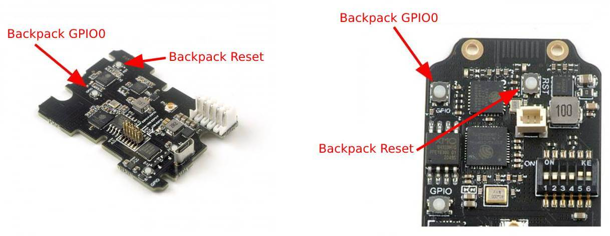

# TX Backpack Setup

## Preparing the TX Module for Backpack Firmware Flashing

For the Happymodel TX Modules, you will need to move the jumpers or dipswitches into the correct position before flashing the firmware. Please see the USB/UART Flashing section of your particular TX Module for the jumper or dipswitch position. You need to activate the `Backpack Flashing` jumper or dipswitch (middle pair). Opening up the module enclosure will be needed as well to access the Buttons on the modules.

[ES24TX Jumpers](../../../quick-start/tx-es24tx/#flashing-via-usbuart){.md-button}

[ES900TX Jumpers](../../../quick-start/tx-es900tx/#flashing-via-usb){.md-button}

Make sure your computer recognizes your TX module as a `USB to UART Bridge`. Windows drivers are linked on the Flashing Guides.

For the NamimnoRC Flash and Voyager TX Modules without an OLED screen (Gen 1 STM-based), make sure you're able to access the Backpack Web Update page(see [Flashing Guide](../../../quick-start/tx-flash2400/)) via WiFi.

For the NamimnoRC OLED-equipped TX Modules, these should already have a ready-to-use Backpack firmwares.

For the AxisFlying Thor modules, these should also come flashed with a ready-to-use Backpack firmware.

## Backpack Firmware Flashing

Flashing Backpack firmware is supported by the ExpressLRS Configurator since v1.2.0. 

Targets:

- `HappyModel TX Backpack`
- `AXIS THOR TX Backpack`
- `FrSky TX Backpack`
- `Namimno TX Backpack`

### via USB/UART

For the Happymodel TX modules, connect it via USB to your computer. As stated above, module should be detected as a `USB to UART Bridge` and the jumper/dipswitches are set in the correct position (middle pins/switches should be On).

On the ExpressLRS Configurator, select your Target and elect your binding phrase which will be used to bind the Backpacks together. It can be different from your usual binding phrase, but there's no issue if you want to use the same. You can also set the Home Network SSID and Password (version 0.2.0).

Once set, click **Build and Flash** on the ExpressLRS Configurator.

*Button Dance:* A few buttons are needed to be pressed on the module while the firmware is compiling. Press and Hold the `GPI0` button then the `RST` button (GPIO is still pressed) then release the `RST` button and then the `GPIO` button.

If you did things right, `Success` message should appear. 

Unplug the USB and change the position of the jumpers/dipswitches for the `Normal Operation` (refer back to the module's Flashing Guide page for the correct position).

Put back the cover of the module and attach it into your module bay.

### via WiFi (ESP-based TX Modules)

!!! info "Note"
    The following section applies to more recently released TX modules like the NamimnoRC OLED-equipped Modules. If you have the older Happymodel modules, and have updated their backpack firmwares to at least 0.1.0, then this can be used for future updates.

Using the ExpressLRS v2.0 Lua script, navigate to `WiFi Connectivity` and select `Enable Backpack WiFi`. The Backpack WiFi Access Point will immediately activate. Connect to the `ExpressLRS TX Backpack` AP (password is `expresslrs`). Navigate your browser to http://10.0.0.1/.

**Build** the TX firmware using the ExpressLRS Configurator. Grab the built `firmware.bin` and drag-and-drop it into the File Upload section of the webpage and click **Update**. Wait a bit (~10s) for the "Update Success! Rebooting...". The AP should automatically disappear and disconnect.

### via WiFi (NamimnoRC Gen1 TX Modules)

For the First Generation NamimnoRC TX modules (No OLED), you will have to first **Build** the Backpack firmware. Once built, grab the `backpack.bin` file from the folder that the ExpressLRS Configurator opened. Open the URL http://elrs_tx.local on your browser and scroll down to where the **WiFi Backpack Firmware Update** section is (shown in the image below). If the page isn't loading, make sure you have followed the Wifi Flashing guide for these modules(see [Flashing Guide](../../quick-start/tx-flash2400/#flashing-via-wifi)).

Wait for a bit (~10s) after the message "Update Success! Rebooting..." appear before you power-cycle the module. Your TX Backpack should now be ready.

## Starting in 0.2.0, you can Update via your Home WiFi Network

With your Home Network SSID and Password set, when you activate the WiFi mode via the lua script (`WiFi Connectivity` -> `Enabled Backpack WiFi`), the Backpack will try to connect to your Home WiFi Network. Once connected, you can access the Web Update page via http://elrs_txbp.local/ and upload your firmware there.

The ExpressLRS Configurator will also detect the device after it has connected. It will be listed in the "Device List" section, and you can press `SELECT`, so that the correct target is automatically selected for **Build**.

Alternatively, you can also **Build and Flash** via the Configurator through WiFi without having to access the Web Update page (just like any ESP-based ExpressLRS receiver).

## How to check you have updated the TX Backpack Firmware?

Navigate to the `WiFi Connectivity` folder of the ExpressLRS v2 Lua script and select `Enable Backpack WiFi`. Scan for Access Points and **ExpressLRS TX Backpack** should appear. Connect into it and point your browser to http://10.0.0.1/.

If you have set your Home Network SSID and Password, point your browser to http://elrs_txbp.local/.

The main banner will show you what kind of device it is and the firmware version that's flashed into it.

## Setup your VRx Backpack

[VRx Backpack Setup](../backpack-vrx-setup/){.md-button}

## Operation

The [Backpack Usage](../esp-backpack/#backpack-usage) section will discuss the Operation of the Backpacks in detail, including Binding, LED Status codes and more.

[Backpack Usage](../esp-backpack/#backpack-usage){.md-button}