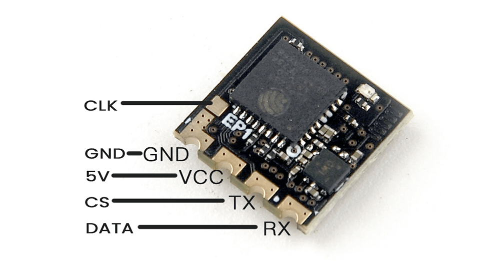
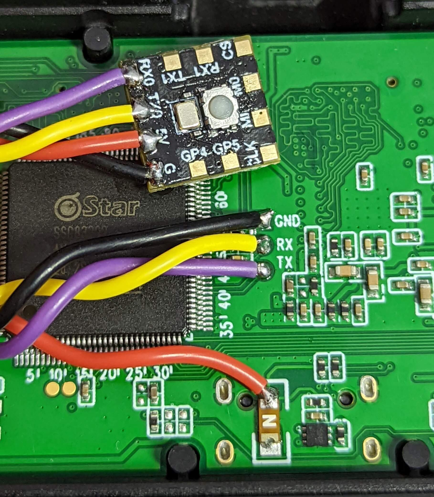
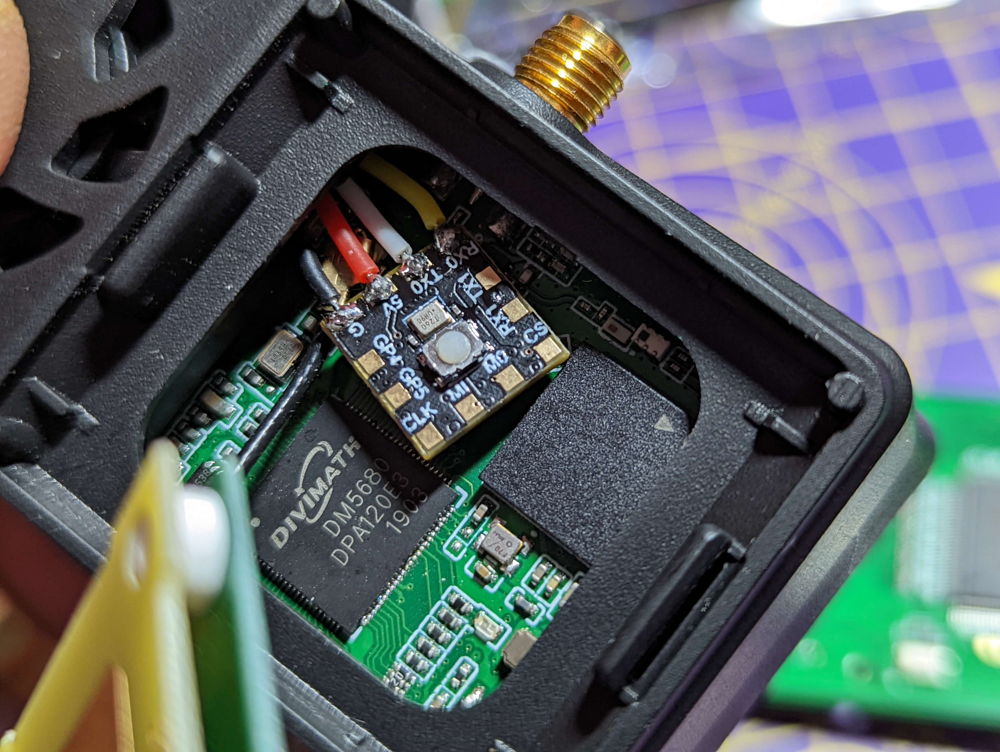

# VRx Backpack Setup

## Flashing your VRx Backpack Device

Before wiring up your VRx Backpack, you NEED to first flash the VRx Backpack firmware into it either via WiFi or UART/FTDI.

Good VRx Backpack candidates are the EP1 or EP2 receivers from Happymodel as these have Boot pads, instead of Boot buttons. The Boot pad will be repurposed for the SPI Clock signal from the VRx module.

The VRx firmware you will flash into your Backpack Device will depend on what VRx module you want to connect it to or it will not work properly.

### Flashing via WiFi (ESP-based ExpressLRS Receivers)

Power up your selected VRx Backpack device (connect 5v and gnd pads to any 5v power source). Let it go into WiFi Update mode (fast blinking LED) and load up the WiFi Update page. In the Address bar of your browser, add `?force=true` to ensure it will accept the VRx Backpack firmware. The resulting URL should read `http://10.0.0.1/?force=true` (if you connected via Access Point) or `http://elrs_rx.local/?force=true` (if your device has connected to your local WiFi network).

!!! note ""
    The `?force=true` is not needed for these ESP-based receivers with factory-firmware. It will only be needed if you have flashed the receiver into ExpressLRS v2.0 and wanted to repurpose it for VRx Backpack.

On the Assets section of the [Backpack Release](https://github.com/ExpressLRS/Backpack/releases) on Git Hub, `Download` the binary suited for your VRx module. Upload this binary into the VRx device using the Web Update page. Wait (~30s) until the LED on the VRx device has turned on again.

Alternatively, you can use the ExpressLRS Configurator to create your binaries for you. **Build** your binary, with the set `binding phrase` (Optional) as well as Home Network SSID and Password (Optional; available starting 0.2.0). Upload the resulting binary into the WiFi Update page as outlined above.

### Flashing via UART/FTDI

!!! note ""
    This method is best used for the DIY ESP01F VRx Backpacks, as these devices do not have any firmware from factory. 

Connect your FTDI Rx pin into the Tx pad of your VRx Device, and the FTDI Tx pin into the Rx pad of the VRx Device; then the 5v and Gnd pads. The Boot pad needs to be bridged with the Ground pad. Connect your FTDI, with the connected VRx device, into a free USB port (VRx Device's LED should light up SOLID). Using the ExpressLRS Configurator, select your VRx module, select the `via UART` method and set your `binding phrase` (Optional) and the Home Network SSID and Password (Optional; Available starting 0.2.0). Click **Build and Flash** and the compiling and flashing should commence. If done right, the Success bar should appear and your VRx Backpack should now be ready for wiring into your selected VRx Module.

### Flashing TBS Fusion for the First Time

You will need an FTDI dongle (USB to UART Bridge) to flash the VRx Backpack firmware into your TBS Fusion module for the first time. You will also have to follow the TBS Fusion [WiFi Module Unbricking Guide](https://team-blacksheep.freshdesk.com/support/solutions/articles/4000153255-tbs-cloud-unbrick-the-wifi-module?fbclid=IwAR0LlQEbzJ0kd7iG-W6yli3Ng90PlYGFLlkun7lFB5pcNIfGGNFvYFUuY5Q) but instead of uploading the WiFi Firmware file from TBS, you will upload the VRx Backpack Firmware that the ExpressLRS Configurator compiled from **Build**.

Any subsequent firmware updates can be done via WiFi.

## Starting 0.2.0, you can Update via your Home WiFi

With your Home Network SSID and Password set, when you activate the WiFi mode via the lua script (`WiFi Connectivity` -> `Enabled VRx WiFi`), the Backpack will try to connect to your Home WiFi Network. Once connected, you can access the Web Update page via http://elrs_vrx.local/ and upload your firmware there.

The ExpressLRS Configurator will also detect the device after it has connected. It will be listed in the "Device List" section, and you can press `SELECT`, so that the correct target is automatically selected for **Build**.

Alternatively, you can also **Build and Flash** via the Configurator through WiFi without having to access the Web Update page (just like any ESP-based ExpressLRS receiver).

## VRx Module Setup before wiring it all up

You will need to set your VRx module to the highest band and channel it can go, usually Race 8 (5917MHz) before wiring up any VRx Backpack. This is to ensure the VRx Backpack knows "where it is" in the selectable channels.

## Connecting the VRx Backpacks to your VRx Modules

Currently supported VRx Modules include:

* ImmersionRC Rapidfire  
* SkyZone SteadyView
* Generic RX5808 Module
* FENIX Module
* Shark Byte RX5.1 HDZero Module

The VRx Backpacks communicate to these modules via SPI bus and involves 3 signal lines: `CLK`, `DATA`, `CS`. Depending on your VRx Backpack, they will either need `5v` (ExpressLRS ESP-based Receiver) or `3.3v` (ESP01F module) and of course the `GND` line.

For the ESP01F Module, you will have to source out a voltage regulator such as an `AMS1117` (1A Low Drop-out Voltage Regulator) which will lower the 5V voltage from the VRx module to the needed `3.3v`.

### Rapidfire Backpack Connection

Follow the wiring guide below for the Rapidfire module. Make sure that the VRx module is set to R8 (5917) for this to work properly.

The VRx Backpack fits snugly in the module bay. No further modding needed.

### SteadyView Backpack Connection

You will need to desolder 3 pins from the module, or cut them off. 

Follow the wiring shown on the image below:

* Blue wire is the CLK pin (Pin 1; connected to Boot pad, if using an ExpressLRS Receiver).
* Green wire is the DATA pin (Pin 2; connected to the RX pad, if using an ExpressLRS Receiver).
* Yellow wire is the CS pin (Pin 3; connected to the TX pad, if using an ExpressLRS Receiver).

The power supply wires are connected as follows:
* Black wire is GND and connected to Pin 7 of the VRx module.
* Red wire is the 5V supply and connected to the last Pin of the module (Pin 9).

### Shark Byte RX5.1 HDZero Module Connection

The VRX has an easily accessible UART on the main board, which is accessed by removing the 4 screws which secure the backplate.
Use the goggle mount to pull the backplate from the housing.

Solder your VRx backpack as shown below:

It is unlikely that you can close the backplate with backpack module between the plate and the main board. There are two solutions:
* Route the wires out of the cooling vents and mount it externally
* Mount the backpack in the front patch, routing the wirse through the goggle mount as shown below:

## How to check you have updated the VRx Backpack Firmware?

Navigate to the `WiFi Connectivity` folder of the ExpressLRS v2 Lua script and select `Enable VRx WiFi`.
The LED will begin blinking rapidly.
Scan for Access Points and **ExpressLRS VRx Backpack** should appear. Connect into it and point your browser to http://10.0.0.1/.

If you have set your Home Network SSID and Password, point your browser to http://elrs_vrx.local/.

The main banner will show you what kind of device it is and the firmware version that's flashed into it.

## Setup your TX Backpack

[TX Backpack Setup](backpack-tx-setup.md){.md-button} 

## Operation

The [Backpack Usage](esp-backpack.md#backpack-usage) section will discuss the Operation of the Backpacks in detail, including Binding, LED Status codes and more.

[Backpack Usage](esp-backpack.md#backpack-usage){.md-button}
