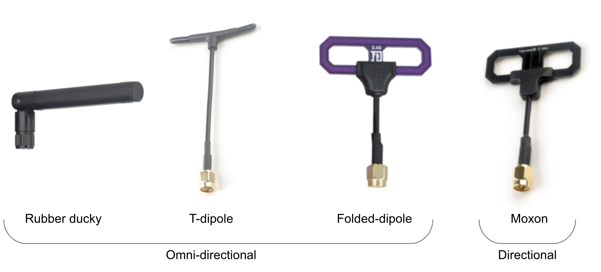
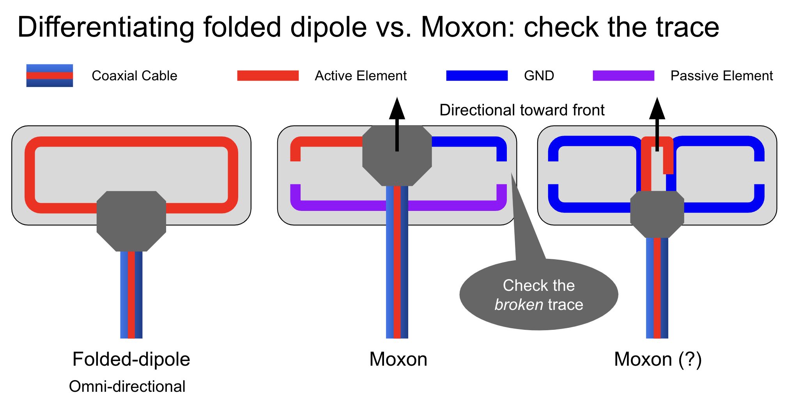
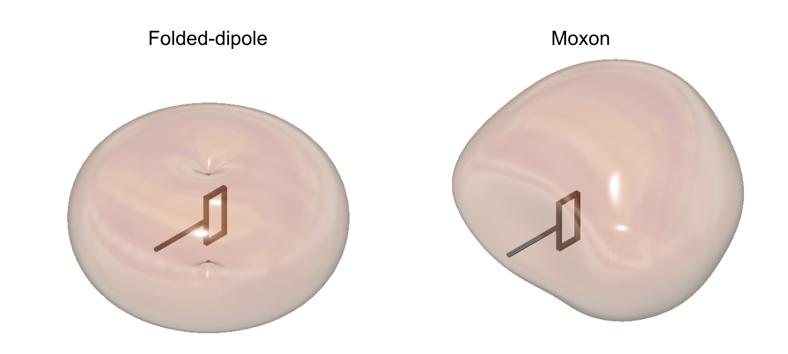
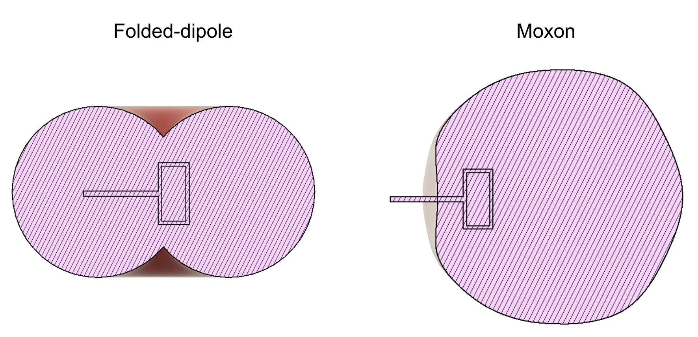

ExpressLRS is #blessed with the benefit of there being many options of transmitters and receivers available from a variety of manufacturers. This begs the question "what is the best?" There is no best option for hardware, only one that has the features you want for the price you want to pay in the size you want it. ExpressLRS does not recommend a specific brand or model, but provide the information to help you select the right ELRS hardware for your needs. The following page will list manufacturers and features to look out for on their hardware.

!!! note Note
    This list will list primarily 2.4GHz hardware with 900MHz only listed in the frequency category, as 2.4GHz has become a significantly larger portion of the ELRS market.

## Manufacturers
  * [Axisflying](https://www.axisflying.com)
  * [BetaFPV](https://betafpv.com)
  * [EMAX](https://emaxmodel.com)
  * [Foxeer](https://www.foxeer.com)
  * [FrSky](https://www.frsky-rc.com)
  * [GEPRC](https://geprc.com)
  * [Happymodel](https://www.happymodel.cn)
  * [HGLRC](https://www.hglrc.com)
  * [iFlight](https://www.iflight-rc.com)
  * [Jumper](https://www.jumper-rc.com)
  * [MatekSys](http://www.mateksys.com)
  * [NamimnoRC](https://m.facebook.com/profile.php?id=100070062095159&_rdr)
  * [RadioMaster](https://www.radiomasterrc.com)
  * [Skystars](https://skystars-rc.com)
  * [Vantac](https://www.frsky-rc.com)
## Receiver Selection
This section exists to list some common features of receivers and will give some examples of receivers with these features.

Each build is different, but these are recommended things to look for when selecting a receiver:

  * **Whoops / Toothpicks / Light aircraft:** Size is probably the most important feature, with a light small receiver and an onboard antenna being the best choice.
  * **Racing Quads:** Size is again most important. Ceramic antennas could be less easily damaged, and the reduced range of tucking them inside the frame is fine due to the short flight range. An external 2.4GHz antenna dipole is still pretty easy to fit and can be tucked away for a small improvement over the ceramic, but comes with a chance of Choppage.
  * **Freestyle Quads:** Minimum size is no longer an issue so Nano-sized receivers are the best bet here. An LNA is going to give you better reception behind obstacles. External antennas are a benefit as well, but you need to trade off how unobstructed the antenna will be versus getting it chopped. Diversity can be of major benefit in medium-range scenarios to prevent antenna nulls from pointing towards transmitters and carbon or concrete blocking one antenna.
  * **Long Range:** For sure you need an LNA, an external antenna, and a PA to extend the telemetry range. This isn't to say these are required for long range, 5km is achievable on a ceramic antenna receiver with no LNA/PA at 250Hz/100mW with a clear line of sight. Diversity can be useful for longer-range quads, to prevent carbon from blocking antennas or antenna nulls from pointing toward the transmitter in certain flight orientations. For planes without a flight controller, PWM receivers will work great. For absolute maximum range, 900MHz can do more but 2.4GHz can still do 50+km.

??? info "Frequency"

    ExpressLRS offers both 2.4GHz and 900MHz systems, with each only working with receivers and transmitters of the same frequency. 2.4GHz is the currently most popular frequency given its legality, features and cost. 2.4GHz links offer the fastest packet rates allowing for a more locked-in feel while piloting and still offering massive amounts of range. 900MHz is the original long-range frequency and still can be great for high wifi pollution environments with slightly better penetration.

    For new users, unless you plan on flying hundreds of kilometers or in a high-noise environment we recommend 2.4GHz hardware such as:

      * Happymodel EP Series
      * Radiomaster RP Series
      * NamimnoRC Flash Series

    If you have an R9 system or similar or plan on flying beyond reasonable ranges, some great 900MHz receivers include:

      * BetaFPV Nano900
      * Happymodel ES900RX
      * GEPRC Nano 900MHz

??? info "Antenna Type"

    Antennas are where the radio waves come and go from the receiver. ExpressLRS offers many different antenna types, with dipoles and ceramic antennas (see [SMD Antennas](../hardware/smd-antenna.md)) being the most common types of reciever antennas. In terms of range: Ceramic antenna < Mini Dipole ("Minimortal-T" style) < sleeved dipole < Half-wave Dipole. A diagram of the antennas and their sizes for the 2.4GHz band is shown below:

    <figure markdown>
      
    </figure>

    Unless otherwise noted, most receivers will have a U.FL/IPEX connecter which supports external antennas. Some receivers with ceramic antennas are:

      * Happymodel EP2 
      * Radiomaster RP2
      * MatekSys R24-S

??? info "Diversity"

    Diversity improves reception compared to standard receivers by using multiple antennas. A standard receiver has a single antenna, while antenna diversity uses two antennas and a switch to route the signal from one or the other. True diversity takes it a step further by using two radio chips, each connected to a different antenna, and choosing the one with the strongest reception at any given time. This provides a level of redundancy which is particularly beneficial for flight where the antenna nulls can point towards the pilot (e.g. freestyle flight)

    <figure>
      
    </figure>

    Some receivers with antenna diversity include:
      
      * Radiomaster RP3
      * Namimno Flash Diversity
      * Matek R24-D

    Some receivers with true diversity include:

      * Happymodel EP1 Dual
      * BetaFPV SuperD

??? info "PWM"

    PWM is used for crafts that do not have flight controllers and allow for direct control of ESCs and Servos. See the page on [PWM](../hardware/pwm-receivers.md) for more in-depth information on using PWM.

    Some PWM receivers include:

      * MatekSys R24-P6
      * Happymodel EPW6
      * Radiomaster ER5A/C

??? info "PA/LNA"

    A Low Noise Amplifier (LNA) directly adds to your incoming RSSI. Typical gains are in the ballpark of +12dBm which will be observed in the RSSI as being 12dBm higher than it would have been without the LNA. This is because the LNA amplifies the incoming signal coming from the antenna before going to the RF chip, which increases the sensitivity of the receiver by boosting the incoming signal. An LNA also boosts the noise by the same amount so the sensitivity limit will likely be lower than the value quoted by the Lua.

    A Power Amplifier (PA) boosts the outgoing signal strength and extends the telemetry range back to the TX. Without a PA, the power output is limited by the RF chip's max power output itself (around +13dBm 20mW). It works the same way as turning up the power output on the transmitter module, however it is not adjustable. The receiver's output can be ran at adjustable power levels given range needs. Most PAs are 20dBm/100mW, meaning the telemetry transmit power can be adjusted to 10, 25, 50 or 100mW.

    Receivers with a PA/LNA will have a listed telemetry output power in dBm or mW

    Some receivers with a PA & LNA are the following:
    
      * Radiomaster RP3 (100mW)
      * Skystars Nano SS24D (20dBm)
      * MatekSys R24-D (23dBm)
      * BetaFPV SuperD (20dBm)

??? info "Size"

    The FPV world shook when ELRS released receivers that were half the size of "nano" sized receivers, included the antenna onboard, and still had kilometers of range at 250Hz/100mW. A small receiver can fit in tight places, but remember that tucking a tiny receiver's ceramic antenna deep inside a stack behind carbon reduces its performance, which was already compromised by the elimination of amplifiers to make it that small. Larger ELRS receivers regain these amplifiers offering better reception and telemetry range at the cost of size and weight. The common size classes are shown below, but there are other receivers with slightly different sizes:

    <figure>
      
    </figure>

    PP Sized Receivers (absolute smallest, lowest range regardless of antennas):

      * Happymodel EP/PP
      * Radiomaster RP
      * BetaFPV Lite

    Nano Sized Receivers (medium sized, can have PA/LNA but tends to lack some features):

      * BetaFPV Nano
      * iFlight RXes
      * Namimno Flash Diversity RX
      * Axisflying Thor RX
      * Namimno Flash RX

    Larger Receivers (most feature rich but also significantly larger)

      * Matek R24-D
      * Radiomaster RP3
      * BetaFPV SuperD

## Transmitter Selection
This section lists out some common features of transmitters and some examples of transmitters with those features

Everyone has different needs for a transmitter but the main needs come down to size, range and integration.

??? info "Built-In Transmitters"

    Certain manufacturers have made handsets with built in ELRS modules, which offer tighter integration with ELRS. These can be updated through the handset as well as generally over WiFi as is standard.

    Some handsets with built-in ELRS include:

      * RadioMaster TX16S ELRS
      * RadioMaster Zorro ELRS
      * BetaFPV Lite Radio 3 Pro ELRS
      * Jumper T-Pro
      * Jumper T-Lite v2

    A notable exception to this list is the iFlight Commando, which, while including a TX built into the handset is simply wired as an external module, and put within the casing. It does support an external module and notably has both 868/915MHz and 2.4GHz options available

??? info "Frequency"

    ExpressLRS offers both 2.4GHz and 900MHz systems, with each only working with receivers and transmitters of the same frequency. 2.4GHz is the currently most popular frequency given it's legality, features and cost. 2.4GHz links offer the fastest packet rates allowing for a more locked-in feel while piloting and still offer massive amounts of range. 900MHz is the original long range frequency and still can be great for high wifi pollution environments with slightly better penetration.

    For new users unless you plan on flying hundreds of kilometers or in a high noise environment we recommend 2.4GHz hardware such as:

      * Axisflying Thor
      * RadioMaster Ranger
      * HappyModel ES24TX Pro
      * Namimno Flash

    If you want to push the limits of range, a 900MHz system might fit within your needs. Some off the shelf 900MHz transmitters include:

      * Namimno Voyager
      * Happymodel ES900TX
      * BetaFPV Micro 915/868MHz

??? info "Size"

    Most ExpressLRS Transmitter modules fit into one of two classes - Micro and Nano. There are some exceptions that fit into multiple or have interesting features that may make them work better for your needs.
    
    Micro modules will fit into the JR bay of a standard transmitter such as a TX16s or QX7, with some examples including:

      * RadioMaster Ranger Micro
      * Namimno Flash
      * HappyModel ES24TX
    
    Nano modules will fit into a lite module bay such as that on a Zorro, T-Pro or X-Lite with some examples including:

      * HappyModel ES24TX Slim Pro
      * RadioMaster Ranger Nano
      * Jumper AION Nano
      * BetaFPV Nano

    Some notable exceptions that can fit into multiple or very specific module bays include:

      * HappyModel ES24TX Lite - Fits onto Jumper T-Lite
      * Axisflying Thor - Has a wire system to be able to plug into any radio with a CRSF output
      * Radiomaster Ranger - includes Micro & Nano mounts and wiring for any CRSF compatible radio

??? info "Power"

    Most ELRS Transmitters have a 250mW or 500mW power cap, but if you need to go a bit further, a select few 1W modules exist (see the [Inverse-square law](https://en.wikipedia.org/wiki/Inverse-square_law) for info on why 1W does not double the range over 500mW), packing that punch needed to go even further. These transmitters include large heatsinks, fans and sometimes temperature-sensing to cool the RF components. Some of these 1W transmitters are:

      * HappyModel ES24TX Pro
      * RadioMaster Ranger (Full Size, Micro and Nano all are 1W)
      * Axisflying Thor
      * BetaFPV Micro TX 1W
      * RadioMaster Boxer
      * Jumper T-Pro Internal
      * NamimnoRC Flash (both OLED & non-OLED models)

??? info "Screens"

    Some transmitters include a small screen that displays useful information and pairs with a small joystick to quickly change settings on the go. This can be useful when paired with handsets running firmware that does not support lua scripts. The two main types of screens are TFT and OLED:

    <figure>
      
    </figure>

    The only transmitter with a TFT screen on the market at the moment is the Axisflying Thor TX.

    Some transmitters with an OLED include:

      * Namimno Flash OLED
      * RadioMaster Ranger
      * BetaFPV Micro TX
      * Jumper AION Nano

??? info "Backpack"

    Most current transmitters will include a [backpack](../hardware/backpack/esp-backpack.md), which enables communication with accessories such as a VRX allowing for tighter integration with the transmitter and drone. Transmitters with a built-in backpack include:

      * HappyModel ES24TX Pro
      * HappyModel Slim Pro
      * NamimnoRC Flash
      * AxisFlying Thor
      * RadioMaster Zorro
      * BetaFPV Micro TX 1W

??? info "Antennas"

    Besides handset integrated transmitters, all ELRS TX modules support many antennas so this serves as a guide to antenna types and connectors.

    ELRS TX Modules have two connecters, which are visually similar - SMA and RP-SMA
    <figure>
      
    </figure>

    These connecters mount many types of antennas which have different types of radiation patterns. The first figure depicts the types of antennas commonly sold with transmitters:
    <figure>
      
    </figure>

    The most common antennas sold besides simple dipoles are moxons and folded dipoles, which visually look similar which helps distinguish the two:
    <figure>
      
    </figure>

    The radiation patterns of a moxon and folded dipole are depicted below in a isotropic, lateral and top view
    <figure>
      
      
      
    </figure>   

??? info "Bling Features"

    Certain transmitters have "bling features" which are less important than the other listed features. Some of these include RGB LEDS, Temperature Sensors and G Sensors.

    [RGB LEDs](../quick-start/led-status.md) are included on many modern TXes, and also serve as a useful status indicator.

    Temperature sensors are useful for higher power transmitters, to turn on the fan only when needed instead of constantly running while transmitting which reduces noise. Currently the only transmitter with this feature is the Axisflying Thor.

    G Sensors/Motion sensors use a 3 axis linear accelerometer to detect the orientation of the transmitter and also can use bump to handoff for [loan model](../software/loan-model.md). The transmitters that ship with this feature is the Axisflying Thor & RadioMaster Ranger
