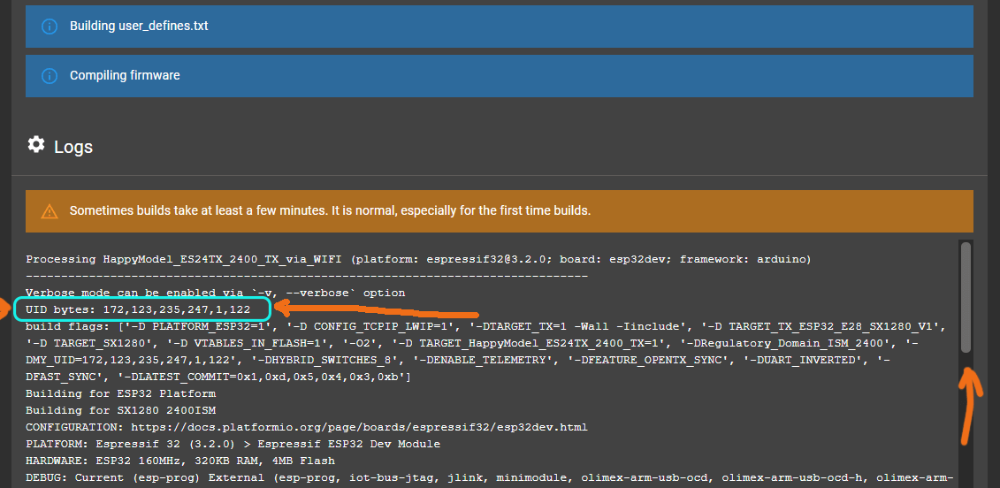

A few Flight Controllers and AIOs have been released with ExpressLRS receivers on-board using SPI instead of a regular UART. This means you can build a more compact and lightweight whoop or nano longrange rig without the need for an external receiver. More of these flight controllers are coming into stores.

Because the ExpressLRS code is "baked-in" to the flight controller firmware instead of using a second microcontroller, these can not be updated the same way external receivers are updated. These SPI receivers always work with the ExpressLRS firmware of the same major version. That is, ExpressLRS 1.x.x and ExpressLRS 2.x.x need different **Flight Controller** firmware (Betaflight builds).

!!! info "NOTE"
    You cannot use the ExpressLRS Configurator to update these FCs.

With [Betaflight 4.3.0](https://github.com/betaflight/betaflight/releases/tag/4.3.0) finally released, you should first update the FC firmware to this released version. The firmware the FC comes with most likely has a pre-release Betaflight 4.3.0 which will only work with ExpressLRS 1.x firmware and may have bugs. A lot of tweaks and fixes were implemented on Betaflight 4.3.0 for these flight controllers and the ExpressLRS Developers highly recommend updating to the latest Betaflight firmware.

In preparation for updating, you should save a copy of your `diff all` dump. Simply go into the CLI Tab of the Betaflight Configurator and execute the command `diff all` then press enter. A bunch of text will show up on the screen. At the bottom of the page, click the **Save to File** button and navigate to the folder you want the file to be saved. Finally click `Save` after taking note of the folder and filename of the text file. You will need to navigate to this file later on, moreover if you already have customized your settings on the flight controller, like rates, pid tune, OSD. For newly acquired flight controllers, this is often unnecessary.

Using the latest [Betaflight Configurator](https://github.com/betaflight/betaflight-configurator/releases), navigate into `Firmware Flasher` and select the latest [Betaflight release](https://github.com/betaflight/betaflight/releases/tag/4.3.0). Depending on your AIO board, the target will differ:

* Happymodel AIO: CRAZYBEEF4SX1280
* BetaFPV AIO: BETAFPVF4SX1280
* SPRacing SPH7RF: Coming soon!

If your Flight Controller model is not in the list above, consult your Flight Controller manufacturer for details.

!!! warning ""
    The Happymodel Mobula6 900MHz AIO with the CrazyF4 ELRS FC (Target: CRAZYBEEF4DX) doesn't use an SPI ExpressLRS receiver. Check the page for [ES915RX](../quick-start/receivers/hmes900.md#es915868rx-discontinued) instead.

Once flashed, you will need to paste in the `diff all` you have saved. Don't forget to type in `save` and press enter once done. Power cycle your flight controller, and you should be set. Review your Betaflight settings (no changes needed for the Receiver Type and Protocol; should already be set with `SPI Receiver`, with Provider as `ExpressLRS`).

<figure markdown>

</figure>

## Binding Procedure

There are two ways to bind the receiver, as shown below

### Button Binding

Put the receiver into bind mode using any of these procedures:

- "Bind" button in the Betaflight Configurator, Receiver Page (if can't be found, [update](#updating) the Betaflight firmware).
- using the CLI, type in `bind_rx` and press enter once.
- press the bind button on the flight controller.
- using the CLI, type in `set expresslrs_uid = 0`, press enter once, then save and reboot

One the SPI receiver is in Bind Mode (indicated by two immediate blinks followed by a short pause), execute the [ExpressLRS](../quick-start/transmitters/lua-howto.md) lua script in your handset and press the `Bind` option. The RX and TX should be now bound (indicated by a SOLID LED on the Flight Controller).

**Please mind the order, RX first, TX second.**

Video Tutorial (thanks to @JyeSmith):

<iframe width="560" height="315" src="https://www.youtube.com/embed/U2sxqx2oT4k" title="YouTube video player" frameborder="0" allow="accelerometer; autoplay; clipboard-write; encrypted-media; gyroscope; picture-in-picture" allowfullscreen></iframe>


### Binding Phrase

The binding phrase is hashed into 6 bytes represented as numbers. These 6 bytes are referred to as the UID bytes. 
UID bytes are entered into the Betaflight CLI for binding. Please [look below](#setting-binding-phrase) for instructions. 
When building via ExpressLRS Configurator or via VS Code, note down the UID bytes from the build log. You can also use the 
[generator below](#uid-byte-generator) to retrieve your UID bytes from your binding phrase.



#### UID Byte Generator

<style>
.bp-input {
  color: #000;
}
</style>

Binding Phrase
<div class="bp-wrapper">
  <input class="md-input bp-input" type="text" placeholder="expresslrs" />
</div>

!!! info "Not updating?"
    If the fields below don't update as you type your binding phrase above, refresh or reload this page in your browser.

UID Bytes
```
```

#### Setting Binding Phrase
Go to Betaflight CLI and enter the following commands.
```
```

<script type="text/javascript" src="//unpkg.com/crypto-js@4.1.1/crypto-js.js"></script>
<script type="text/javascript">
  window.addEventListener("load", (event) => {
    initBindingPhraseGen();
  });
</script>

## RF Mode Adjustment

!!! info "NOTICE"
    Latest Betaflight 4.3 firmware for these AIOs no longer needs the following CLI command. Adjustments from the Lua script propagates into the FCs.

These AIOs with ExpressLRS SPI Receivers are set to use 500Hz as default. To adjust it, you will need to go into Betaflight CLI and use the following commands:

```
set expresslrs_rate_index = [your index]
save
```

Where `[your index]` corresponds to the following:

- 500Hz = 0
- 250Hz = 1
- 150Hz = 2
- 50Hz = 3

## Thanks are in order

The SPI ExpressLRS implementation would not have been possible without the work and huge efforts from the following developers:

[@phobos-](https://github.com/phobos-)
[@hydra](https://github.com/hydra)
[@klutvott123](https://github.com/klutvott123)
[@SteveCEvans](https://github.com/SteveCEvans)
[@ctzsnooze](https://github.com/ctzsnooze)
