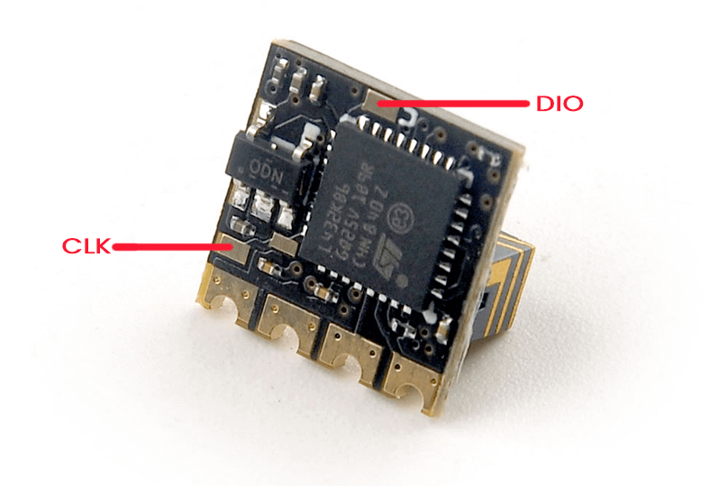

## Wiring up your receiver

<figure markdown>

</figure>

The image above show the receiver pinout and their connections. As we're dealing with UART connection, Rx on receiver goes to a TX pad in the FC, and Tx on Receiver goes to an uninverted Rx pad on the FC.

The PP **doesn't** have a `Boot` pad so there's no need to bridge any pads.

## Configuring your Flight Controller

See this [page](configuring-fc.md) on how your flight controller should be configured. These settings apply on both INAV and Betaflight (and other flight controller software).

Ports Tab should be setup so that Serial RX is on the UART where you have soldered the receiver.

Receiver protocol is `CRSF`, with `serialrx_inverted = off` and `serialrx_halfduplex = off`.

The next step will not be able to proceed properly and you'll have issues later if any of these are set differently. Once you have configured your Flight Controller software, close its Configurator and unplug-replug the USB cable from the FC or your computer. This will refresh the connection and you'll be ensured that the port is not busy (of high importance with the Passthrough Flashing Method).

## Flashing via Passthrough

Target: `HappyModel_PP_2400_RX_via_BetaflightPassthrough`

Device Category: `Happymodel 2.4 GHz`

Device: `HappyModel PP 2400 RX`

The PP receivers do not have Wifi, and so, it can only be updated via Passthrough or STLink(see below).

You don't need to be connected to Betaflight or INAV Configurator during this step. Close your FC Configurator and unplug the USB to refresh the connection.

Once wired, power up your FC by connecting a LiPo or, if the receiver is getting powered via USB, connect your USB cable to a vacant port.

Using the ExpressLRS Configurator, with the correct Target selected and [Firmware Options] set, hit **Build & Flash**. Wait a bit for the process to finish and you should see a "Success" banner. 

Power-cycle the FC and verify receiver connects to the Tx module (power up the Tx first, then the Receiver).

## Flashing via STLink

Target: `HappyModel_PP_2400_RX_via_STLINK`

Device Category: `Happymodel 2.4 GHz`

Device: `HappyModel PP 2400 RX`

This will require connecting a ST Link to CLK, DIO, 5V and GND.

Then with the correct Target selected and [Firmware Options] set, click **Build & Flash** in the ExpressLRS Configurator. Wait for the process to finish and you should see the "Success" banner.

[Connect](#wiring-up-your-receiver) your receiver to your FC and you should be ready for the next steps.

[Firmware Options]: ../firmware-options.md