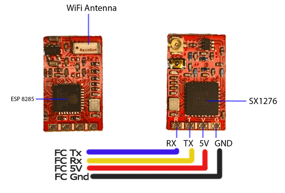
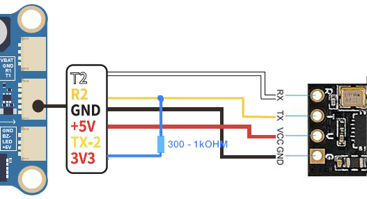
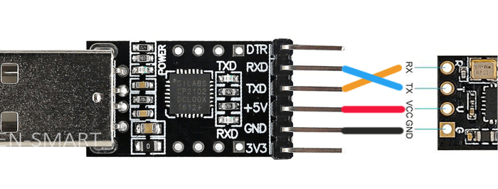

## Check your Target
Because of the massive shortage of `STM32` Chips, there are more `ESP8285` based RXes on the market. These support WiFi updating, and can be easily distinguished with a few tricks. The simplest way to tell is if on the rear of the RX (the side without the U.fl/SMD antenna) there is a large white component with the label **RainSun** (pictured below). If this is not there, you have an STM32 based target, if it is you have an `_ESP_` target, and can update using Wifi!

!!! Note
    New versions of the receiver also have the PCB Wifi Antenna, and doesn't have the Rainsun SMD Antenna mentioned above. These will use the same ESP-based Target, NOT the STM-based target.

## Wiring up your receiver

!!! attention ""
    *Note: There are Flight Controllers that will pull the RX pads `LOW` which will put the ESP-based receivers into `Bootloader Mode` unintentionally. A solid LED light on these receivers even with the TX module off is a sign they are in Bootloader Mode. If this is the case, rewire the receiver to a different UART.*

<figure markdown>

</figure>

The image above show the receiver pinouts and their connections. As we're dealing with UART connection, Rx on receiver goes to a TX pad in the FC, and Tx on Receiver goes to an uninverted Rx pad on the FC.

There are Flight Controllers that put their Receiver UART's RX pads Low, which in turn, puts the ESP-based (e.g. EP1 and EP2) receivers to Bootloader mode unintentionally. One remedy is to wire them into a different UART, or wire a pull-up resistor (300-1k ohm) between the Rx pad of the FC and a 3.3v or 5v pad, as shown below.

<figure markdown>

</figure>

## Configuring your Flight Controller

See this [page](configuring-fc.md) on how your flight controller should be configured. These settings apply on both INAV and Betaflight (and other flight controller software).

Ports Tab should be setup so that Serial RX is on the UART where you have soldered the receiver.

Receiver protocol is `CRSF`, with `serialrx_inverted = off` and `serialrx_halfduplex = off`.

The next step will not be able to proceed properly and you'll have issues later if any of these are set differently. Once you have configured your Flight Controller software, close its Configurator and unplug-replug the USB cable from the FC or your computer. This will refresh the connection and you'll be ensured that the port is not busy (of high importance with the Passthrough Flashing Method).

## Betaflight Passthrough

Targets: 

- `NamimnoRC_VOYAGER_900_ESP_RX_via_BetaflightPassthrough` 
- `NamimnoRC_VOYAGER_900_RX_via_BetaflightPassthrough`

Device Category: `NamimnoRC VOYAGER 900 MHz`

Device :

- `NamimnoRC VOYAGER 900 ESP RX`
- `NamimnoRC VOYAGER 900 RX`

Once [wired properly] to your FC, connect USB. Did your receiver powered up too (with both LEDs lit)? If so, disconnect USB, hold the bind button on your receiver, and reconnect to USB. The LED should start alternating between the Green and Red LEDs. Once it's alternating, you can then let go of the Bind Button.

If your receiver didn't get powered from USB, have a lipo ready and continue with the next steps. On the ExpressLRS Configurator, with your [Firmware Options] set, click on **Build & Flash**. Like on the TX module, it will take a while on the first time. Watch out for the `Passthrough Init` stage. This stage will check your FC Configuration for the Serial RX UART (Software Inversion via "set serialrx_inverted" and Half Duplex mode via "set serialrx_halfduplex" will be checked; both should be off.)

Once `Retry... ` lines appear, connect a LiPo if your receiver isn't powered by the USB (i.e. power up your receiver and FC). On subsequent flash, you can have the LiPo plugged in and receiver powered up from the start.

For the ESP-based receivers, you can connect a LiPo during the `PASSTHROUGH DONE` section of the Log.

Wait for this process to finish. It's done once the "Success" prompt is shown.

## Wifi Updating (ESP Only - Recommended)

Target: `NamimnoRC_VOYAGER_900_ESP_RX_via_WIFI`

Device Category: `NamimnoRC VOYAGER 900 MHz`

Device: `NamimnoRC VOYAGER 900 ESP RX`

### Method 1

With the receiver [wired properly] to your FC, select the right target and set your [Firmware Options] in the ExpressLRS Configurator.

**Build** the firmware. Once done, it should open a new window where the `NamimnoRC_VOYAGER_900_ESP_RX-<version>.bin` is. Do not close this window so you can easily navigate to it once it's time to upload the firmware into the receiver.

Power your Flight Controller by either connecting a LiPo or attaching the USB cable (if the receiver gets powered from USB via a 4v5 pad). The receiver's LED will blink slowly at first, and after 20s or 30s (can be adjusted via ExpressLRS Configurator using `AUTO_WIFI_ON_INTERVAL`), it should blink fast indicating it's on Wifi Hotspot Mode.

Connect to the Wifi Network the receiver has created. It should be named something like `ExpressLRS RX` with the same `expresslrs` password as the TX Module Hotspot.

<figure markdown>

</figure>

Navigate to the same web address as the TX Module (usually http://10.0.0.1). The Firmware upload page should load, and using the File Upload Form, navigate where the correct Receiver `NamimnoRC_VOYAGER_900_ESP_RX-<version>.bin` is (like with the Tx module, you can also drag-and-drop the firmware file into the form field or use the `Browse` or `Choose File` button). Click on the **Update** button and the firmware file will be uploaded and the update process should commence.

A white page should load momentarily with the message **Update Success! Rebooting...**. Wait a little bit (**you can wait until the LED on the Receiver starts to blink slowly again**) and the receiver should be updated. Power cycle and your module and receiver should now be bound (given you have updated the Tx Module as well, and that they have the same binding phrase and options).

**Update for version 2.0**

Once you have updated to firmware version 2.0 or newer, the Web Update page on the Hotspot will get a few updates of its own. It will get the Update progress bar, and a Popup will be shown for Success or Error messages. Additionally, you can configure Home Network SSID and Password if you chose not to use ExpressLRS Configurator to set them. Once these are set, you can use the two methods below.

### Method 2

!!! note ""
    Note: This method will only work once the Home Network SSID and Password has been configured with the receiver

With the receiver [wired properly] to your FC, select the right target and set your [Firmware Options] in the ExpressLRS Configurator.

**Build** the firmware. Once done, it should open a new window where the `NamimnoRC_VOYAGER_900_ESP_RX-<version>.bin` is. Do not close this window so you can easily navigate to it once it's time to upload the firmware into the receiver.

Power up your Flight Controller by either connecting a LiPo or attaching the USB cable (if the receiver gets powered from USB via a 4v5 pad). The receiver's LED will blink slowly at first, and after 20s or 30s (can be adjusted via ExpressLRS Configurator using `AUTO_WIFI_ON_INTERVAL`), it should blink fast indicating it's on Wifi Mode.

Using your browser, navigate to http://elrs_rx.local/. The Wifi Update page should load. It should show your device target along with the version of the firmware it currently has.

Scroll down to the Firmware Update section, shown below:

Drag-and-drop the `NamimnoRC_VOYAGER_900_ESP_RX-<version>.bin` file created by the ExpressLRS Configurator into the Choose File field, or manually navigate to the Folder by clicking the `Choose File` button. Once the correct file is selected, click the `Update`. Wait for the process to complete, indicated by a Green popup screen.

Wait a little bit (**you can wait until the LED on the Receiver starts to blink slowly again**) and the receiver should be updated.

You can now power down your Flight Controller along with the receiver.

### Method 3

!!! note ""
    Note: This method will only work once the Home Network SSID and Password has been configured with the receiver

With the receiver [wired properly] to your FC, select the right target and set your [Firmware Options] in the ExpressLRS Configurator.

Power up your Flight Controller by either connecting a LiPo or attaching the USB cable (if the receiver gets powered from USB via a 4v5 pad). The receiver's LED will blink slowly at first, and after 20s or 30s (can be adjusted via ExpressLRS Configurator using `AUTO_WIFI_ON_INTERVAL`), it should blink fast indicating it's on Wifi Mode.

**Build & Flash** the firmware using the ExpressLRS Configurator. Wait for the process to complete, indicated by the "Success" prompt and the Receiver LED has gone back to the Slow Blink mode. You can now power down the Flight Controller.

## UART Updating (ESP Only)

Target: `NamimnoRC_VOYAGER_900_ESP_RX_via_UART`

Device Category: `NamimnoRC VOYAGER 900 MHz`

Device: `NamimnoRC VOYAGER 900 ESP RX`

Wire the receiver into the FTDI, with the TX on receiver connected to the Rx on the FTDI, and the RX on receiver connected to the Tx of the FTDI. Wire 5V and GND of the FTDI to 5V and GND of the Receiver. Press the button while powering the RX on, and release - the LED should now be solid.

<figure markdown>

</figure>

Select the target and set your [Firmware Options] and once done, click on **Build and Flash**.

## STLink Updating (STM32 Only)

Target: `NamimnoRC_VOYAGER_900_RX_via_STLINK`

Device Category: `NamimnoRC VOYAGER 900 MHz`

Device: `NamimnoRC VOYAGER 900 RX`

The units provided to the documentation team did not have STM32 chips due to the chip shortage, however, the following should apply. Wire CLK, 3v3, GND and DIO to the recievers STLink pins.

Select the target and set your [Firmware Options] and once done, click on **Build and Flash**.

[Firmware Options]: ../firmware-options.md
[wired properly]: wiring-up.md#namimnorc-voyager-flash