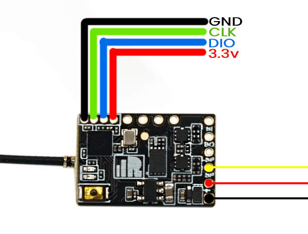

### FrSky RXes  

*Note: This will be the same wiring you'll use for flying and the next firmware updates (via Passthrough). Forget the factory wiring guide!*

#### Passthrough Flashing (works with Betaflight, iNav)

Make sure the correct [Bootloader](../flashing-bootloader) has been flashed to the receiver prior to wiring it up to your flight controller. Using the wiring guide above, find a free, uninverted UART in your FC. You can use your FC's wiring guide for a Crossfire or Ghost receiver.

Once wired to your FC, connect USB. Did your receiver powered up too (with both LEDs lit)? If so, disconnect USB, hold the bind button on your receiver, and reconnect to USB. The LED should start alternating between the Green and Red LEDs. Once it's alternating, you can then let go of the Bind Button.

If your receiver didn't get powered from USB, have a lipo ready and continue with the next steps. On the ExpressLRS Configurator, with your Options set, click on **Build & Flash**. Like on the TX module, it will take a while on the first time. Watch out for the `Passthrough Init` stage. This stage will check your FC Configuration for the Serial RX UART (Software Inversion via "set serialrx_inverted" and Half Duplex mode via "set serialrx_halfduplex" will be checked; both should be off.)

If `Retry... ` lines appear, connect a LiPo if your receiver isn't powered by the USB (i.e. power up your receiver and FC).

Wait for this process to finish. It's done once the "Success" prompt is shown.

#### Flashing via STLink (only recommended as last resort)

This method is irreversible. It will remove the ability to reflash back to Frsky firmware. You have been warned!
Make sure your STLink dongle is properly recognized by your System as such (Drivers are installed, etc.).

Disable 'Readout Protection'. To do this download the [ST-LINK Utility](https://www.st.com/en/development-tools/stsw-link004.html) and follow this quick [how to video](https://youtu.be/SEYQ1HpRmk0). Or alternatively under linux you can use <a href="/software/open-ocd">OpenOCD</a>. 

Connect your STLink to the receiver as shown in the wiring guides below. You'll need the GND, DIO (Data), CLK (Clock) and 3.3v.

<small>r9mm/r9mini</small>

<small>r9mx</small>

Using the correct target specific for your receiver, hit "Build & Flash".

Once done, wire your receiver to your Flight Controller. Passthrough flashing can now be used for updating the receiver.