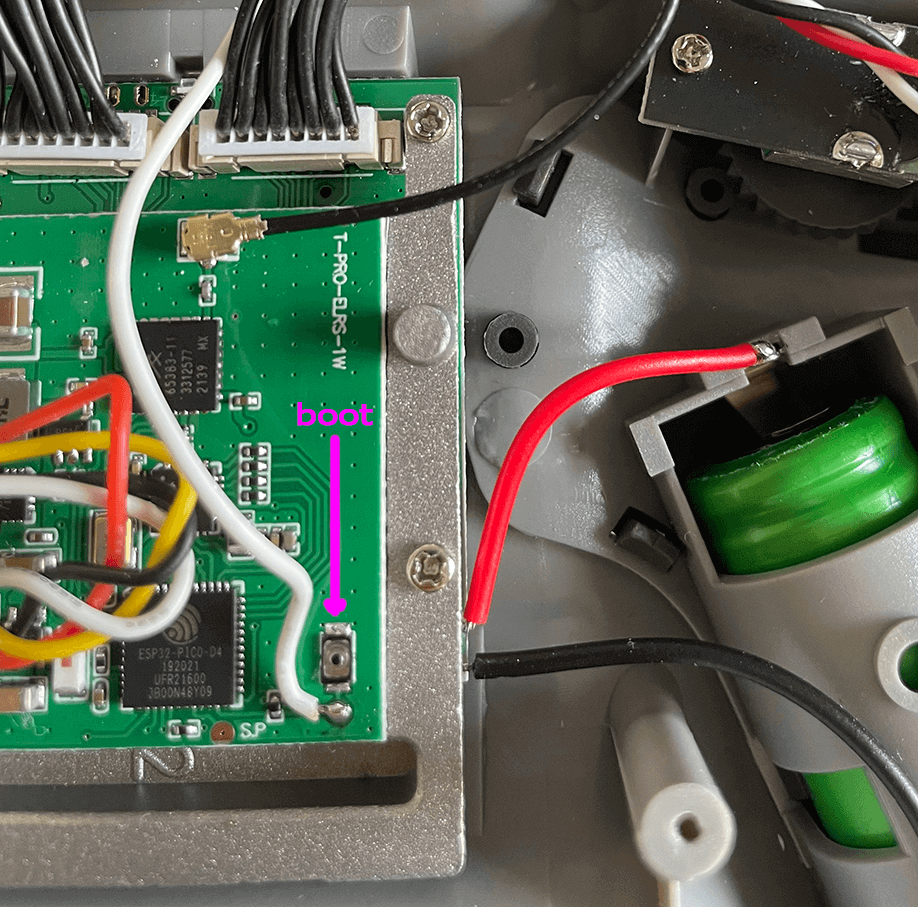
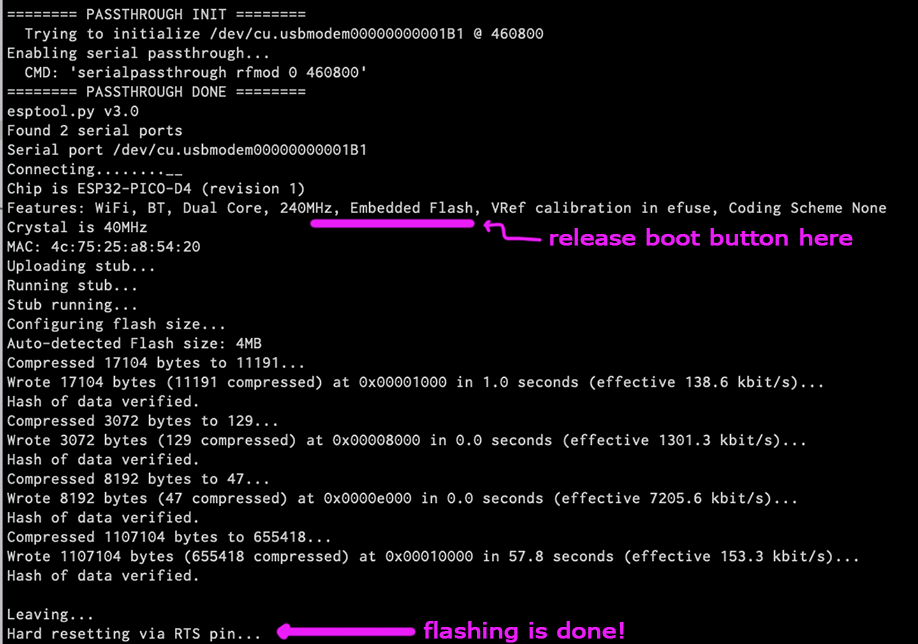

## Flashing via Wifi

Targets: `Jumper_AION_T-Pro_2400_TX_via_WIFI`

### Method 1

With the correct target selected and [Firmware Options] set, **Build** your firmware using the ExpressLRS Configurator. Once it's done, it should open the Target folder for you where the `Jumper_AION_T-Pro_2400_TX-<version>.bin` file is. Do not close this window so you can easily locate the correct file to upload to the module.

The next steps will require the [ExpressLRS Lua Script](https://github.com/ExpressLRS/ExpressLRS/blob/master/src/lua/elrsV2.lua?raw=true) (right-click, save as). Download the ExpressLRS lua script and save it to your Radio's `/Scripts/Tools` folder. Execute the ExpressLRS lua script by pressing "System Menu" in your radio and then under Tools, select `ExpressLRS`.

Select **WiFi Connectivity** from the Lua script and then select **Enable WiFi**. Press OK once more to activate the WiFi on the Tx Module. Connect to the Access Point the module will create called `ExpressLRS TX Module`, with the password being `expresslrs`.

Using your browser, navigate to the correct page (typically http://10.0.0.1/) and it should show an upload form (you will have to scroll down a bit). You can drag-and-drop the `Jumper_AION_T-Pro_2400_TX-<version>.bin` file that the ExpressLRS Configurator created. You can also click the `Choose File` button and navigate to the folder where the firmware was created. Ensure that you have selected the correct firmware file and click `Update`.

If a Popup appears warning you're flashing the wrong target, click `Flash Anyway`. These units came pre-flashed from factory with an older Target, before these specific targets are available.

Once the file is uploaded, a pop-up confirmation will show up. Wait for the Lua script screen to close the "WiFi Running" screen and your module should be updated now.

Verify the version and hash in the main screen of ExpressLRS Lua script (you will first need to close it and relaunch the script).

**Join Local Network**

You can configure Home Network SSID and Password if you chose not to use ExpressLRS Configurator to set them. Once these are set, you can use the next two methods below.

### Method 2

With the correct target selected and [Firmware Options] set, **Build** your firmware using the ExpressLRS Configurator. Once it's done, it should open the Target folder for you where the `Jumper_AION_T-Pro_2400_TX-<version>.bin` file is. Do not close this window so you can easily locate the correct file to upload to the module.

Using the [ExpressLRS Lua Script](https://github.com/ExpressLRS/ExpressLRS/blob/master/src/lua/elrsV2.lua?raw=true) (right-click, save as), select `Wifi Connectivity` then choose `Enable WiFi` and if you have flashed your Tx Module with your Home WiFi Network details or have set it in Join Network section of the Update Page, it will connect to the local network automatically.

Using your browser, navigate to http://elrs_tx.local and the WiFi Update page should show up. Scroll down towards the Firmware Update section, as shown below:

Drag-and-drop the `Jumper_AION_T-Pro_2400_TX-<version>.bin` file created by the ExpressLRS Configurator into the Choose File field, or manually navigate to the Folder by clicking the `Choose File` button. Once the correct file is selected, click the `Update`. Wait for the process to complete, and once the file is uploaded, a pop-up confirmation will show up.

Wait for the Lua script screen to close the "WiFi Running" screen and your module should be updated now.

Verify the version and hash in the main screen of ExpressLRS Lua script (you will first need to close it and relaunch the script).

### Method 3

Using the [ExpressLRS Lua Script](https://github.com/ExpressLRS/ExpressLRS/blob/master/src/lua/elrsV2.lua?raw=true) (right-click, save as), select `Wifi Connectivity` then choose `Enable WiFi` and if you have flashed your Tx Module with your Home WiFi Network details or have set it in Join Network section of the Update Page, it will connect to the network automatically.

Using the ExpressLRS Configurator, select the correct Target and set your [Firmware Options]. Click **Build and Flash** and wait for the compile process to complete. You should see a section as pictured below and the Success message marking the update process complete.

Wait for the Lua script screen to close the "WiFi Running" screen and your module should be updated now.

Verify the version and hash in the main screen of ExpressLRS Lua script (you will first need to close it and relaunch the script).

## HELP! I think I bricked my internal module!

Okay, breathe. The module is recoverable.

You will need a couple of files:

1. An EdgeTX binary that allows you to use the USB port on the radio to reflash the module. Download it from [here](../../assets/recovery/tpro-ada778ee4.bin) (Right-click, Save-as) and save it into your Jumper T-Pro SD Card `/firmware` folder.
2. A zip file with all the recovery scripts and firmwares. Download it from [here](../../assets/recovery/jumper-recover.zip) (Right-click, Save-as) and extract it into a folder in your harddrive. If you want your `Binding Phrase` and other [Firmware Options] set for you when you flash via this method, **Build** your `firmware.bin` file first via the ExpressLRS Configurator and replace the `firmware.bin` in this folder.

### Procedure

With the EdgeTX binary in your `/firmware` SD Card folder, reboot the radio into DFU/Bootloader mode. You can get to this mode by holding the trim switches inwards and pressing the power button. Release the button and trim switches and you should be in DFU/Bootloader mode. Write the firmware into the radio and reboot to ensure it got written. One way to check is to plug-in a USB cable and a new menu item should be available to you: USB Serial (Debug). You will need this menu item in the next steps.

Turn off the radio.

The next steps will require you to take the radio apart. You will need a small Philips screwdriver for this. There are 10 small Philips screws that keep both halves of the radio together.

!!! warning "Handle with Care"
    There are a couple of wires connecting the module into the main board of the radio, along with battery leads. Do not yank out the back cover of the radio from its front half. You can leave the battery in its cradle as you will need to power up the radio in the next steps.

Leave all the wiring intact, you will need a still-functional radio for the next steps!

Power up the radio and make sure internal ExpressLRS module is the active one. Plug in a usb cable and select `USB Serial (Debug)` as shown in the photo below.

Open up the folder where you extracted the Recovery scripts.

Locate the Boot button in the Internal ExpressLRS module and Press and Hold it while you double-click the `recover.bat` script. Release the button when you see the `Features:` line appears.

Wait for the process to finish. A `Hard resetting via RTS pin...` will show up once done and the script should terminate on its own.

Unplug the USB cable from the T-Pro and check with the Lua Script whether you have your Internal module back.

If you chose to use the `firmware.bin` file in the original Recovery zip file, it doesn't have your `Binding Phrase` and other [Firmware Options]. You will need to reflash the module via WiFi using the steps above.

Do not forget to reassemble the T-Pro. Let's hope you didn't lose a screw!

[Firmware Options]: ../firmware-options.md
[Radio Preparation]: tx-prep.md