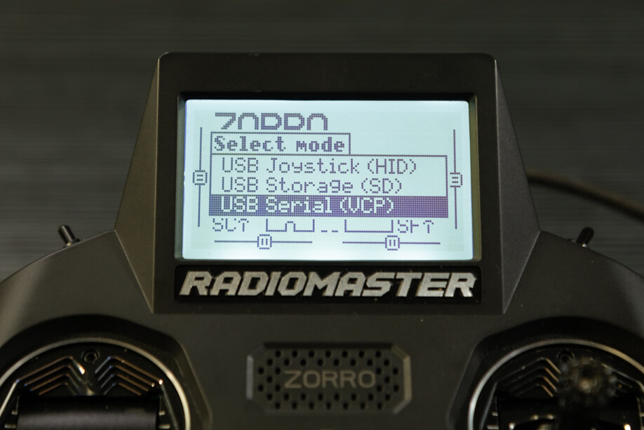
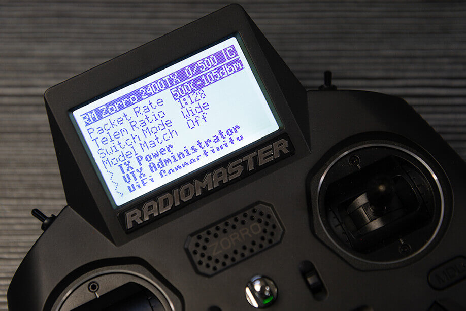

!!! warning "Viewer Warning"
    Target names tentative. Document not yet finalized.

## Flashing via Wifi

Targets:

- `RadioMaster_Zorro_2400_TX_via_WIFI`
- `Jumper_Internal_via_WIFI`

### Method 1

With the correct target selected and [Firmware Options] set, **Build** your firmware using the ExpressLRS Configurator. Once it's done, it should open the Target folder for you where the `Radiomaster_Internal-<version>.bin` or `Jumper_Internal-<version>.bin` file is. Do not close this window so you can easily locate the correct file to upload to the module.

The next steps will require the [ExpressRLS Lua Script](https://github.com/ExpressLRS/ExpressLRS/blob/master/src/lua/elrsV2.lua?raw=true) (right-click, save as). Download the ExpressLRS lua script and save it to your Radio's `/Scripts/Tools` folder. Insert/attach your module into your module bay and make sure it's not loose and there's proper connection with the radio (see the [Radio Preparation] page). Execute the ExpressLRS lua script by pressing "System Menu" in your radio and then under Tools, select `ExpressLRS`.

If the script is stuck at `Loading...`, then there's a chance your module is still in v1.x firmware, your External RF module is not set to CRSF or that your module is not well-connected to the module bay pins.

Select **WiFi Connectivity** from the Lua script and then select **Enable WiFi**. Press OK once more to activate the WiFi on the Tx Module. Connect to the Access Point the module will create called `ExpressLRS TX Module`, with the password being `expresslrs`.

Using your browser, navigate to the correct page (typically http://10.0.0.1/) and it should show an upload form (you will have to scroll down a bit). You can drag-and-drop the `Radiomaster_Internal-<version>.bin` or `Jumper_Internal-<version>.bin` file that the ExpressLRS Configurator created. You can also click the `Choose File` button and navigate to the folder where the firmware was created. Ensure that you have selected the correct firmware file and click `Update`.

Once the file is uploaded, a pop-up confirmation will show up. Wait for the Lua script screen to close the "WiFi Running" screen and your module should be updated now.

Verify the version and hash in the main screen of ExpressLRS Lua script.

**Join Local Network**

Once you have updated to firmware version 2.0 or newer, the Web Update page on the Hotspot will get a few updates of its own. It will get the Update progress bar, and a Popup will be shown for Success or Error messages. Additionally, you can configure Home Network SSID and Password if you chose not to use ExpressLRS Configurator to set them. Once these are set, you can use the two methods below.

### Method 2

With the correct target selected and [Firmware Options] set, **Build** your firmware using the ExpressLRS Configurator. Once it's done, it should open the Target folder for you where the `Radiomaster_Internal-<version>.bin` or `Jumper_Internal-<version>.bin` file is. Do not close this window so you can easily locate the correct file to upload to the module.

Using the [ExpressLRS Lua Script](https://github.com/ExpressLRS/ExpressLRS/blob/master/src/lua/elrsV2.lua?raw=true) (right-click, save as), select `Wifi Connectivity` then choose `Enable WiFi` and if you have flashed your Tx Module with your Home WiFi Network details or have set it in Join Network section of the Update Page, it will connect to the local network automatically.

Using your browser, navigate to http://elrs_tx.local and the WiFi Update page should show up. Scroll down towards the Firmware Update section, as shown below:

Drag-and-drop the `Radiomaster_Internal-<version>.bin` or `Jumper_Internal-<version>.bin` file created by the ExpressLRS Configurator into the Choose File field, or manually navigate to the Folder by clicking the `Choose File` button. Once the correct file is selected, click the `Update`. Wait for the process to complete, and the module will reboot (~1min).

Verify the version and hash in the main screen of ExpressLRS Lua script.

### Method 3

Using the [ExpressLRS Lua Script](https://github.com/ExpressLRS/ExpressLRS/blob/master/src/lua/elrsV2.lua?raw=true) (right-click, save as), select `Wifi Connectivity` then choose `Enable WiFi` and if you have flashed your Tx Module with your Home WiFi Network details or have set it in Join Network section of the Update Page, it will connect to the network automatically.

Using the ExpressLRS Configurator, select the correct Target and set your [Firmware Options]. Click **Build and Flash** and wait for the compile process to complete. You should see a section as pictured below and the Success message marking the update process complete.

Verify the version and hash in the main screen of ExpressLRS Lua script.

## Flashing via EdgeTX Passthrough

Targets:

- `RadioMaster_Zorro_2400_TX_via_ETX`
- `Jumper_Internal_via_ETX`

With your handset turned on, connect a USB data cable on the USB data port of the Radio. Select `USB Serial(Debug)` in the option window that pops up.

Using the ExpressLRS Configurator, select the latest version (v2.1.0 or newer) and the correct Device Target and set the Flashing method to `via ETX Passthrough`.

Set your Binding Phrase (optional) and other relevant [Firmware Options] like Local WiFi Network SSID and password.

Once that's done, click **Build and Flash** and wait for the Success banner from the Configurator.

Unplug the USB and verify with the [ExpressLRS Lua Script](https://github.com/ExpressLRS/ExpressLRS/blob/master/src/lua/elrsV2.lua?raw=true) (right-click, save as) you have a working internal module and that you have updated to the version you have selected.

[Firmware Options]: ../firmware-options.md
[Radio Preparation]: tx-prep.md