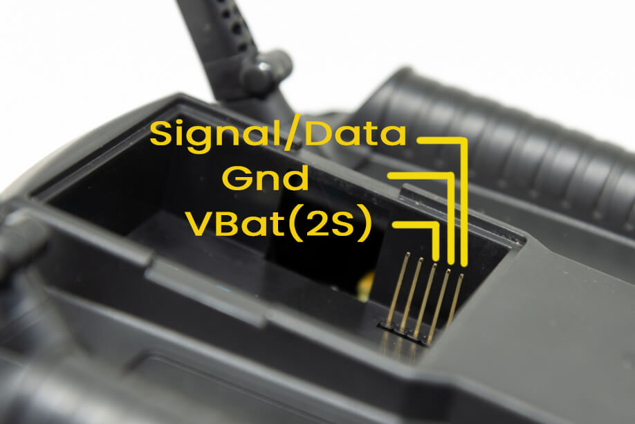
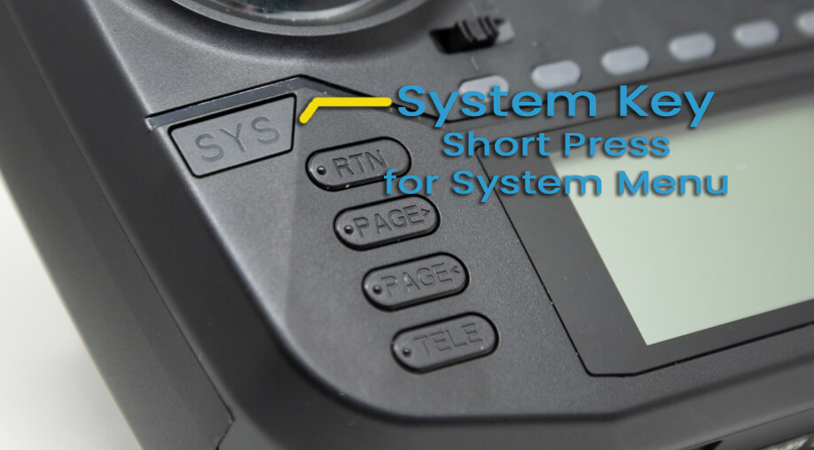
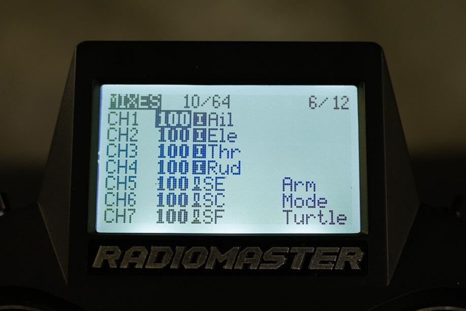
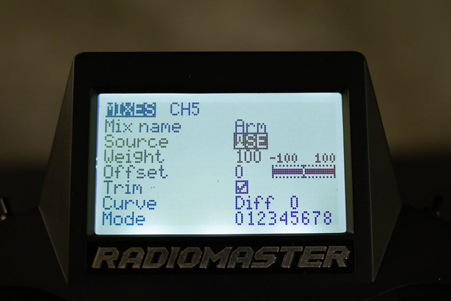
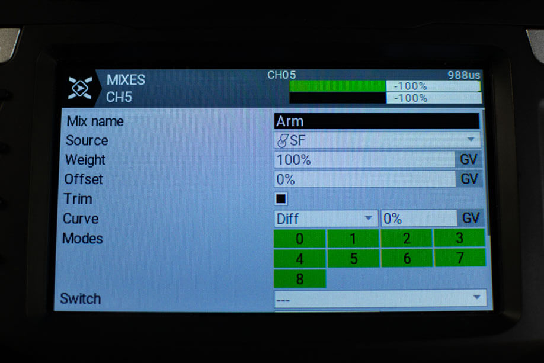

## External ExpressLRS Modules

Insert or attach your External ExpressLRS Transmitter Module into your Radio module bay, making sure no pins are bent or missing. External ExpressLRS Modules require three (3) pins to work: VCC/VBAT, GND and S.Port/Data/Signal.

<figure markdown>

<figcaption>Micro External Bay Pinout</figcaption>
</figure>

<figure markdown>

<figcaption>Nano External Bay Pinout</figcaption>
</figure>

## Internal ExpressLRS Modules

Make sure you do have an Internal ExpressLRS Module on your shiny new radio. The following handsets come in both ELRS (ExpressLRS) or 4-in-1 variants; with some coming in with a third (CC2500). Only the ELRS variant works with ExpressLRS. The others will not work as they have a different Hardware incompatible with ExpressLRS.

- RadioMaster TX16S Mark II (ELRS, 4-in-1 CC2500) - ExpressLRS variant will have an ELRS sticker on the box.
- RadioMaster TX12 Mark II (ELRS, 4-in-1, CC2500) - ExpressLRS variant will have an ELRS sticker on the box and an ELRS sticker in the JR module bay.
- RadioMaster Zorro (ELRS, 4-in-1, CC2500) - ExpressLRS variant will have an ELRS sticker on the box.
- RadioMaster Boxer (ELRS, 4-in-1, CC2500) - ExpressLRS variant will have an ELRS sticker on the box and an ELRS sticker in the JR module bay.
- Jumper T-Lite V2 (ELRS, 4-in-1, CC2500) 
- Jumper T-Pro V1/V2 (ELRS, 4-in-1)
- BetaFPV Lite Radio 3 Pro (ELRS, CC2500) - A sticker with the barcode at the bottom of the box should tell you it's an ELRS variant or the CC2500 variant.

<figure markdown>

<figcaption>Example Sticker On RadioMaster Handset/Radios</figcaption>
</figure>

## Radio Operating System

ExpressLRS **requires** CRSFShot or Mixer Sync to ensure full support for high packet rates. You should have [OpenTX 2.3.12](https://www.open-tx.org/2021/06/14/opentx-2.3.12) or newer, or [EdgeTX 2.4.0](https://github.com/EdgeTX/edgetx/releases/tag/v2.4.0) or newer; These versions have full CRSFShot/Mixer Sync support.

To determine your Radio Operating System Version, load the Version page from the System Menu of your Radio:

1. Press the ++"SYS"++ Key.
    - Older Radios or those with only one Menu Key will need to long-press the ++context-menu++ Key to access the System Menu.
    - Consult your Radio User's Manual on how to access the System Menu.
2. Press ++"PAGE"++ Key until you reach the Version Page.

<figure markdown>

<figcaption>System Key; Short-Press to access the System Menu</figcaption>
</figure>

<figure markdown>

<figcaption>Menu Key; Long-Press to access the System Menu</figcaption>
</figure>

If you have an older version, please first update your Radio OS to at least the mentioned versions. Please consult your Radio Operating System Updating Procedure if you don't know how.

ExpressLRS highly recommends [EdgeTX](https://github.com/EdgeTX/edgetx/releases) for the best experience and compatibility. EdgeTX has introduced options that old and new Radio handsets will benefit from, like One Bit Sample Mode (mainly for old FrSky Radios like the X9D and the QX7) and Mega Bauds (baud rates higher than 400K).

??? Tip "Simplest EdgeTX Updating Procedure (click/tap to expand)"
    1. Visit http://buddy.edgetx.org/.
    2. Select the EdgeTX version and the Radio Model you want to update from the Left-hand side column.
    3. Click the ++"Download .bin"++ button at the bottom of the page.
    4. Save the firmware file into your Radio's SD Card, inside the `Firmware` Folder.
    5. Reboot the Radio into DFU/Bootloader mode.
        - Start by turning off your radio.
        - Press and hold the two horizontal Trim switches then press the Power button. The Screen should Light up. Release the buttons.
        - Some Radios have a different procedure, like the BetaFPV Lite Radio 3 Pro. Consult the Manual for the steps to get it into this DFU/Bootloader mode.
    6. Select `Write Firmware`.
    7. Navigate to the EdgeTX firmware file you just downloaded.
    8. Follow the screen prompts.
    9. Once Writing is complete, reboot the radio.
    10. Check the Radio's Version Page to verify you have the version you need.

Check [this page](https://github.com/EdgeTX/edgetx.github.io/wiki/EdgeTX-Installation-Guide) for the EdgeTX installation instructions if you're coming in from OpenTX.

## Radio Settings

### Serial Baud Rate

The Baud Rate is the speed to which (in this instance) the Transmitter module and the Radio Handset communicate. It is measured in bits per second. Common baud rates include 115200bps (sometimes shown as 115K) and 400000bps (sometimes shown as 400K).

A faster or higher baud rate means that the module and radio can talk much faster, further lowering the end-to-end latency of the system. However, not all radio handsets or transmitter modules are capable of higher baud rates as this is highly dependent on the hardware.

Depending on the firmware that is running on your radio handset, you can change the baud rate setting to better suit your setup. 

To get to the baud rate setting on your radio:

=== "EdgeTX, Internal Module"

    1. Press the ++"SYS"++ Key. 
        - Older Radios or those with only one Menu Key will need to long-press the ++context-menu++ Key to access the System Menu.
        - Consult your Radio User's Manual on how to get to the System Menu.
    2. Press the ++"PAGE"++ Key until you get to the Hardware page.
    3. Scroll down until you reach the `Baudrate` setting.
    4. Press the ++enter++ Key.
    5. Use the Scroll wheel to change and select the `Baudrate` you want to use.
    6. Press ++enter++ Key once to apply the changes.
    7. Reboot the Radio (turn it Off, then turn it On again).

    <figure markdown>
    
    <figcaption>Baudrate setting on EdgeTX for Internal ExpressLRS Modules</figcaption>
    </figure>

=== "EdgeTX, External Module"

    1. Press the ++"MDL"++ Key. 
        - Older Radios or those with only one Menu Key will need to short-press the ++context-menu++ Key to access the Model Menu.
        - Consult your Radio User's Manual on how to get to the Model Menu.
    2. Press the ++"PAGE"++ Key until you get to the Model Setup page. On Colored Screen Radios, this should not be needed.
    3. Scroll down until you reach the External RF settings.
    4. Select the `Baudrate` setting.
    5. Press the ++enter++ Key.
    6. Use the Scroll wheel to change and select the `Baudrate` you want to use.
    7. Press ++enter++ Key once to apply the changes.
    8. Reboot the Radio (turn it Off, then turn it On again).

    <figure markdown>
    
    <figcaption>Baudrate setting on EdgeTX for External ExpressLRS Modules</figcaption>
    </figure>

=== "OpenTX"

    1. Press the ++"SYS"++ Key. 
        - Older Radios or those with only one Menu Key will need to long-press the ++context-menu++ Key to access the System Menu.
        - Consult your Radio User's Manual on how to get to the System Menu.
    2. Press the ++"PAGE"++ Key until you get to the Hardware page.
    3. Scroll down until you reach the `Baudrate` setting.
        - If you don't see this setting, that means your radio doesn't support changing the baud rate in this firmware and is locked at 400000.
    4. Press the ++enter++ Key.
    5. Use the Scroll wheel to change and select the `Baudrate` you want to use.
    6. Press ++enter++ Key once to apply the changes.
    7. Reboot the Radio (turn it Off, then turn it On again).

    <figure markdown>
    
    <figcaption>Baudrate setting on Older Radios</figcaption>
    </figure>

#### Recommended Baud Rates

The minimal required Baudrate depends on the highest Packet Rate you intend to run. The Baudrate should be set to:

- 400K (400000bps): for Packet Rates of 250Hz and lower. This setting should work on most Radios and TX Modules.
- 921k (921000bps): for Packet Rates of 500Hz and lower.
- 1.87M (1870000bps): for Packet Rates F1000 and lower.

However, there are some exceptions:

- The FrSky Taranis QX7 ACCST, Horus X12S and Horus X10S cannot reliably run 400K baud rate without the [Crossfire Mod](https://blog.seidel-philipp.de/fixed-inverter-mod-for-tbs-crossfire-and-frsky-qx7/).

- The FrSky Taranis X9D has proven to be finicky even with the default 400K baud rate and will benefit from the One Bit Sample Mode setting and a Hardware Mod. See [Troubleshooting the X9D](../../hardware/x9d-troubleshooting.md) for more details.

On other Radios, you can set the Baudrate higher than 400K but will highly depend on what TX Module you will use with it.

#### Max Usable Baud Rates

| Internal TX Module | Max Baud Rate | Notes |
| ---- | ---- | ---- |
| RadioMaster TX16S | 5.25M | |
| RadioMaster Zorro | 5.25M | |
| RadioMaster Boxer | 5.25M | |
| RadioMaster Pocket | 5.25M | |
| RadioMaster MT12 | 5.25M | |
| RadioMaster TX12 | 5.25M | |
| Jumper T-Lite V2 | 1.87M | Limited by Handset |
| Jumper T-Pro | 1.87M | Limited by Handset |
| Jumper T20 | 1.87M | Limited by Handset |
| Jumper T14 | 5.25M | |
| Jumper T15 | 5.25M | |
| BetaFPV Lite Radio 3 Pro | 5.25M | |

| External TX Module | Max Baud Rate | Notes |
| ---- | ---- | ---- |
| Happymodel ES24TX (inc. slim, nano, etc) | 5.25M | |
| Happymodel ES24TX Pro/Slim Pro | 5.25M | |
| Happymodel ES900TX | 5.25M | |
| Happymodel ES915/868TX | 1.87M | STM-based |
| BetaFPV Micro & Nano (V1 & V2) | 5.25M | |
| BetaFPV SuperG | 5.25M | |
| RadioMaster Ranger (Micro & Nano included) | 5.25M | |
| RadioMaster Bandit (Micro & Nano included) | 5.25M | |
| Axisflying Thor | 5.25M | |
| Emax Aeris OLED & Nano | 5.25M | |
| NamimnoRC Flash/Voyager (no OLED) | 3.75M | STM-based |
| NamimnoRC Flash/Voyager OLED | 5.25M | |
| Vantac Lite | 1.87M | |
| Jumper Aion Nano | 1.87M | |
| iFlight Command 8 | 3.75M | wired as external module |
| HGLRC Hermes | 5.25M | |
| HGLRC T ONE OLED | 5.25M | |
| Frsky R9M/R9M Lite/R9M Lite Pro | 1.87M | |
| Frsky R9M 2018 (non-ACCESS) | 115K | [Resistor Mod](../../hardware/inverter-mod.md) for 400K |
| QuadKopters JR & Slim | 5.25M | |
| Siyi FM30 | 1.87M | STM-based |
| ImmersionRC GHOST | 1.87M | STM-based |

!!! note "Note"
    The Max Baud Rate for external modules will still depend on the capabilities of the Radio Handset. 

    As stated above, older radios like the QX7 and X9D(+) will require hardware mods and software tweaks, like the One Bit sampling mode, to work reliably at higher baud rates. We recommend not going higher than 400K on these radios. Set them higher at your own risk.

    Newer EdgeTX radios can easily use higher baud rates without modification and we recommend using the maximum baud rate whenever you can. 

??? question "My TX Module is not in this list! (click/tap to expand)"
    Don't be salty. That just means the maintainers are late with the updates. Newer TX modules being released are all ESP-based now. If your TX module has WiFi or Bluetooth Connectivity, then they are ESP-based, and thus, should be capable of 5.25M Baud Rate (depending on the handset).

### ADC Filter

The ADC filter is enabled by default in OpenTX and is known to cause issues with RC Command data. This can result in "jagged" RC command responses in black box logs, caused by sequential RC packets that have the same command value (which were "smoothed" by the ADC filter). We recommend turning the ADC filter OFF in [OpenTX/EdgeTX](https://www.youtube.com/watch?v=ESr2H_EZ89Q).

To check and change this setting, follow these steps:

1. Press ++"SYS"++ Key.
    - Older Radios or those with only one Menu Key will need to long-press the ++context-menu++ Key to access the System Menu.
    - Consult your Radio User's Manual on how to get to the System Menu.
2. Press the ++"PAGE"++ Key until you reach the Hardware Page.
3. Scroll down until you reach the `ADC Filter` setting.
4. Press ++enter++ Key to toggle it On or Off.

??? info "EdgeTX 2.7.0 (and newer) Per-model Settings (click/tap to expand)"

    With EdgeTX 2.7 or newer, you can set this per model (Global, On, Off) as this is helpful on Fixed Wing models equipped with PWM receivers connected to slower servos.

    1. Press ++"MDL"++ Key.
        - Older Radios or those with only one Menu Key will need to short-press the ++context-menu++ Key to access the Model Menu.
        - Consult your Radio User's Manual on how to get to the Model Menu.
    2. Press the ++"PAGE"++ Key until you reach the Model Setup Page. On Colored Screen Radios, this should not be needed.
    3. Scroll down until you reach the `ADC Filter` setting.
    4. Press ++enter++ Key once.
    5. Use the Scroll wheel to select between Global(uses the setting from the Hardware page in the System Menu), On or Off.
    6. Press ++enter++ Key once more to set it.

## Model Setup

### RF Protocol

!!! Note
    If you're using an External ExpressLRS Module, make sure the Internal RF Module is **OFF**.

    If your Radio has an Internal ExpressLRS Module, and you want to use it instead of an external module, then set the External RF Module to **OFF**, and then set the Internal RF Module to **CRSF** Protocol.

ExpressLRS uses the CRSF serial protocol to communicate between the transmitter and the TX module. Follow the following procedure to set it up on the currently selected Model:

=== "External ExpressLRS Modules"

    1. Press the ++"MDL"++ Key.
        - Older Radios or those with only one Menu Key will need to short-press the ++context-menu++ Key to access the Model Menu.
        - Consult your Radio User's Manual on how to get to the Model Menu.
    2. Press the ++"PAGE"++ Key until you reach the Model Setup Page. On Colored Screen Radios, this should not be needed.
    3. Scroll down until you reach the Internal RF settings. Set this to `Off`.
    3. Scroll down until you reach the External RF settings.
    4. Set the Mode to `CRSF`.
        - You can also change the baud rate setting at this point.
    5. (Optional) Set the Receiver ID to a Unique Number.
    6. Press the ++"RTN"++ Key or Exit the Model Menu

    <figure markdown>
    
    </figure>

    <figure markdown>
    
    </figure>

=== "Internal ExpressLRS Modules"

    1. Press the ++"MDL"++ Key.
        - Older Radios or those with only one Menu Key will need to short-press the ++context-menu++ Key to access the Model Menu.
        - Consult your Radio User's Manual on how to get to the Model Menu.
    2. Press the ++"PAGE"++ Key until you reach the Model Setup Page. On Colored Screen Radios, this should not be needed.
    3. Scroll down until you reach the Internal RF settings.
    4. Set the Mode to `CRSF`.
    5. (Optional) Set the Receiver ID to a Unique Number.
    6. Scroll down until you reach the External RF settings. Set this to Off.
    7. Press the ++"RTN"++ Key or Exit the Model Menu

    ??? info "No CRSF Mode Option? (click/tap to expand)"
        If for some reason, you cannot find the CRSF Protocol under the Internal RF Modes, set the `Internal Module Type` to CRSF via your Radio's `System Menu -> Hardware` page.

        1. Press the ++"SYS"++ Key. 
            - Radios without a dedicated ++"SYS"++ Key will need to long-press the ++context-menu++ Key to access the System Menu.
            - Consult your Radio User's Manual on how to get to the System Menu.
        2. Press the ++"PAGE"++ Key until you get to the Hardware page.
        3. Scroll down until you reach the Internal RF settings.
        4. Set the Type to `CRSF`.
            - You can also set the Baudrate at this point.
        5. Press the ++"RTN"++ Key or Exit the Hardware Menu, and go back into setting your Internal RF module.

    <figure markdown>
    
    </figure>

    <figure markdown>
    
    </figure>

!!! Note
    The iFlight Commando 8 is NOT using an internal RF module for its ExpressLRS units, unlike the RadioMaster Zorro, RadioMaster TX16S MK2, RadioMaster TX12 MK2, Jumper T-lite V2, Jumper T-pro or the BetaFPV Lite Radio 3 Pro.

    Set the Internal RF module to Off, and set the External RF module to CRSF protocol, as any External RF module requires.

### Switches and Aux Channels

By default, a fresh model does not have any Aux Channels configured (Aux channels start from Ch5, with the first 4 Channels assigned to your joysticks). If moving any of the switches in your radio doesn't affect your Modes in Betaflight or INAV, this is one of the main reasons. So let's get this sorted out!

1. Press the ++"MDL"++ Key.
    - Older Radios or those with only one Menu Key will need to short-press the ++context-menu++ Key to access the Model Menu.
    - Consult your Radio User's Manual on how to get to the Model Menu.
2. Press the ++"PAGE"++ Key until you reach the Mixes Page.
3. Scroll down and select the Channel you want to configure.
4. Long press ++enter++ and select Edit and press ++enter++ once more.
5. (Optional) You can name this channel however you want to remind you of its purpose.
6. Select Source. Press the ++enter++ Key.
7. Activate or flick the Switch you'd want to use for this channel. 
    - An example would be for CH5, which will be your Arming switch, you'd want to choose a 2-position switch.
8. Press the ++enter++ Key once more to set the switch.
9. Press ++"RTN"++ Key once to exit the Channel Mix editor.
10. Repeat steps 3-9 until you have configured all the switches you think you will need.

=== "Mono-Screen Radio"

    <figure markdown>
    
    </figure>
    
    <figure markdown>
    
    </figure>

=== "Colored-Screen Radio"

    <figure markdown>
    
    </figure>

    <figure markdown>
    
    </figure>
