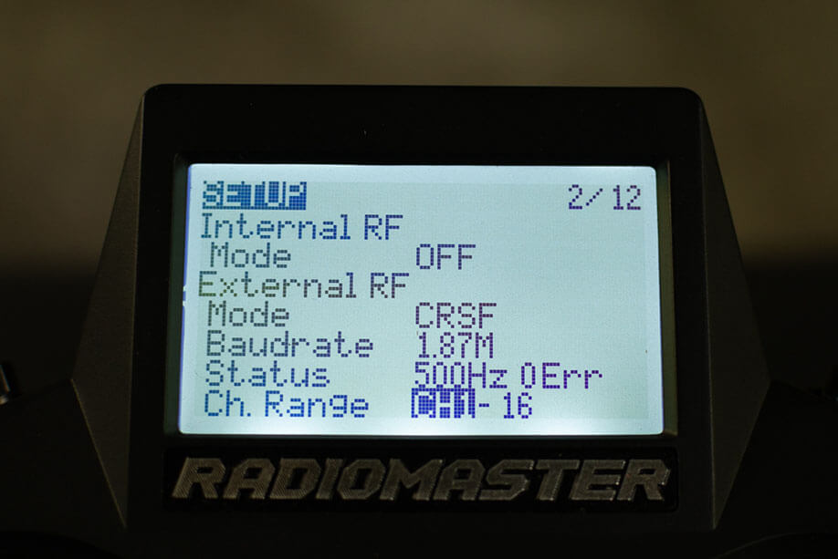
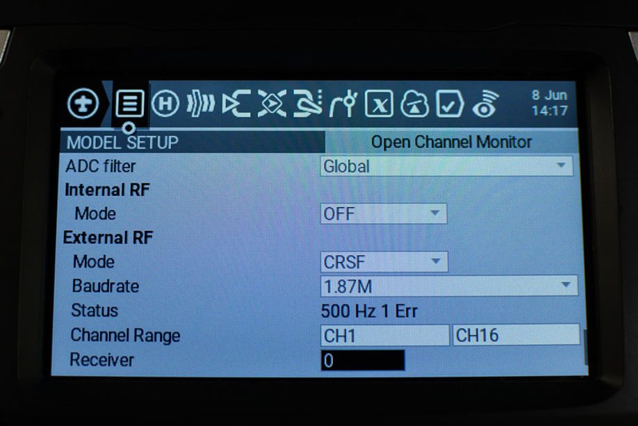
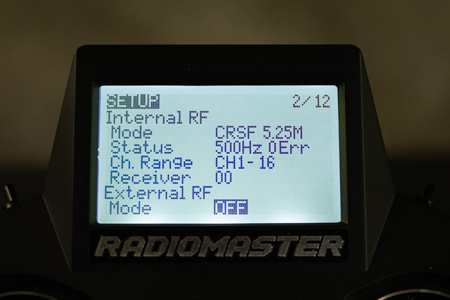
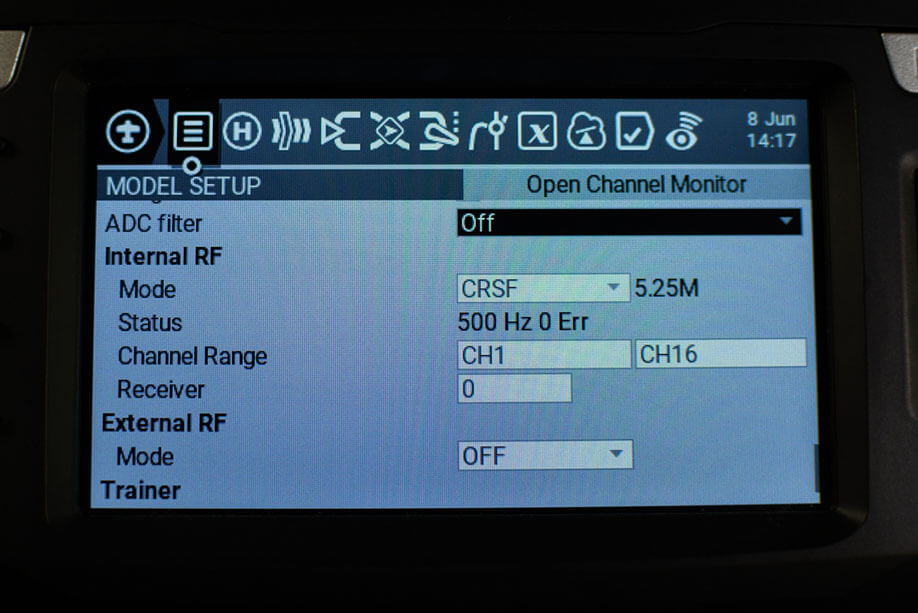

## Radio Firmware with CRSFShot/Mixer Sync

ExpressLRS **requires** CRSFShot or Mixer Sync to ensure full support for high packet rates. Starting with [OpenTX-2.3.12](https://www.open-tx.org/2021/06/14/opentx-2.3.12), `CRSFshot` has been fully implemented, and thus you will have to update your OpenTX radio to these [newer](https://www.open-tx.org/downloads.html#Releases23-ref) versions.

The ExpressLRS Devs, however, highly recommends [EdgeTX](https://github.com/EdgeTX/edgetx/releases) for the best experience and compatibility. There are options in EdgeTX that old and new Radio handsets will benefit from, like the One Bit sample mode for the older Frsky Radios (X9D, QX7) and Mega Bauds (Baudrates higher than 400K). 

## Radio Setup

### Serial Baud Rate

The Baud Rate is the speed to which (in this instance) the Transmitter module and the Radio Handset communicate. It is measured in bits per second. Common baud rates include 115200bps and 400000bps.

Faster or higher baud rate means that the module and radio can talk much faster, further lowering the end-to-end latency of the system. However, not all radio handsets or transmitter modules are capable of higher baud rate as this is highly dependent on the hardware.

Depending on the firmware that is running on your radio handset, you can change the baud rate setting to better suit your setup. This setting can be found in the System Menu -> Hardware page, under the Max Bauds (earlier OpenTX) or Baudrate (EdgeTX; recent OpenTX). On EdgeTX 2.7.0 and later, External RF modules now uses their own Baudrate setting (see Model Setup section below). Internal CRSF Modules will still use the Baudrate setting in the System Menu -> Hardware page.

<figure markdown>

<figcaption>Baudrate setting on Colored Screen Radios</figcaption>
</figure>

<figure markdown>

<figcaption>Baudrate setting on Older Radios</figcaption>
</figure>

The 500Hz Packet Rate requires at least 400K Baud Rate setting on the Radio handset. 

The F1000 Packet Rate requires more than 400K Baud Rate setting on the Radio handset.

Radios such as the Frsky QX7, X10/S, X12 will require either the [Crossfire Mod](https://blog.seidel-philipp.de/fixed-inverter-mod-for-tbs-crossfire-and-frsky-qx7/) or the OneBit Sample mode (found just before the ADC Filter setting in EdgeTX System Menu -> Hardware page) if a 400K or higher Baud Rate is desired. The Taranis X9D(+) has proven to be finicky even with the default 400K Baud Rate setting (see [Troublshooting the X9D](../../hardware/x9d-troubleshooting.md)) and could use the OneBit Sample Mode as well.

!!! info "Note"
    When Radio Baud Rate is set at 115200, 250Hz will be the maximum Packet Rate you can use.

As this setting also involves the module, it should be noted that you must also consider the type of module you are using with the radio. For instance, the R9M 2018 cannot reliably run at 400K Baud Rate setting and will require the [Resistor Mod](../../hardware/inverter-mod.md) first. If you can run your Radio Handset at a lower 115200 Baud Rate, then you don't have to do this Mod. STM-based modules like the R9M 2019, Ghost, Happymodel ES915TX or the Gen1 No OLED NamimnoRC Flash and Voyager modules can run at 1.87M Baud Rate. ESP-based modules like the Happymodel ES24TX, BetaFPV Nano & Micro or the Axisflying Thor can run up-to 3.75M or even 5.25M.

Be warned though. Just because you can doesn't mean you should. If you're experiencing constant Telemetry Lost/Recovered even nearby and/or that the Lua Script fails to load properly, then it's a sign your radio and/or module cannot run the selected Baud Rate. Lower it down a notch or settle with 400K Baud Rate.

### ADC Filter

The ADC filter is enabled by default in OpenTX and is known to cause issues with RC Command data. This can result in "jagged" RC command responses in black box logs, caused by sequential RC packets that have the same command value (which were "smoothed" by the ADC filter). We recommend turning the ADC filter OFF in [OpenTX](https://www.youtube.com/watch?v=ESr2H_EZ89Q).

With EdgeTX 2.7 or newer, you can set this per-model (Global, On, Off) as this is helpful on Fixed Wing models equipped with PWM receivers connected to slower servos.

## Model Setup

### RF Protocol

!!! Note
    If you're using an External ExpressLRS Module, make sure the Internal RF Module is **OFF**.

    If your Radio has an Internal ExpressLRS Module, and you want to use it instead of an external module, then set External RF Module to **OFF**, and then set the Internal RF Module to **CRSF** Protocol.

ExpressLRS uses the CRSF serial protocol to communicate between the transmitter and the TX module. To set this up, enter into your model settings, and on the "Model Setup" tab, enable your "External RF" and select "CRSF" as the protocol:

<figure markdown>

</figure>

<figure markdown>

</figure>

For Radios equipped with Internal ExpressLRS modules, like the RadioMaster Zorro, RadioMaster TX16S MK2, RadioMaster TX12 MK2, Jumper T-lite V2, Jumper T-pro or the BetaFPV Lite Radio 3 Pro, set the Internal RF Module to **CRSF** Protocol and the External RF Module to OFF if you want to use the Internal ExpressLRS module instead of an external one. If for some reason, you cannot find the CRSF Protocol under the Internal RF Modes, set the `Internal Module Type` to CRSF via your Radio's `System Menu -> Hardware` page.

<figure markdown>

</figure>

<figure markdown>

</figure>

!!! Note
    iFlight Commando 8 is NOT using an internal RF module for its ExpressLRS units, unlike the RadioMaster Zorro, RadioMaster TX16S MK2, RadioMaster TX12 MK2, Jumper T-lite V2, Jumper T-pro or the BetaFPV Lite Radio 3 Pro.

    Set the Internal RF module to Off, and set the External RF module to CRSF protocol, as any External RF module requires.

### Switches and Aux Channels

By default, a fresh model do not have any Aux Channels configured (Aux channels start from Ch5, with the first 4 Channels assigned to your joysticks). If moving any of the switches in your radio doesn't affect your Modes in Betaflight or INAV, this is one of the main reasons. So let's get this sorted out!

On the current model, navigate to the Mixes Page (Model Menu-> Mixes). You will need to assign switches to the remaining channels, as shown in the following images.

<figure markdown>

</figure>

<figure markdown>

</figure>

Select the Channel, long press Enter and select Edit. You can name this channel however you want to remind you of its purpose. Then under Source, set it to the Switch you'd want to use for this channel. An example would be for CH5, which will be your Arming switch, you'd want to choose a 2-position switch.

<figure markdown>

</figure>

<figure markdown>

</figure>

Once you're done, press the RTN key to go back to the Mixes page. Do the same to the rest of the Channels you need.

**Now that your radio is set, you can now proceed with flashing ExpressLRS!**