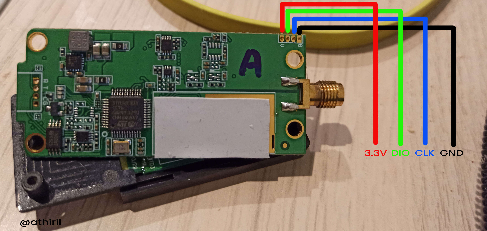

## Flashing via OpenTX (Requires OpenTX 2.3.12 or newer)

### Flashing the Bootloader

The bootloader is required to be flashed first prior to flashing the ExpressLRS firmware as the bootloader will replace the factory-bootloader, and enable the hardware to instead use the ExpressLRS code.

Using an `OpenTX` transmitter, you flash the bootloader, and then flash ELRS.

Here is a quick 2 minute demo if you would rather watch a video than read the steps:
<iframe width="560" height="315" src="https://www.youtube.com/embed/DG3f-lnNlms" title="YouTube video player" frameborder="0" allow="accelerometer; autoplay; clipboard-write; encrypted-media; gyroscope; picture-in-picture" allowfullscreen></iframe>

With the previous step ([Preparing your Radio](../quick-start/tx-prep.md)) done, you should now readily flash your R9 Transmitter Module.

Copy [`r9m_elrs_bl.frk`](https://github.com/ExpressLRS/ExpressLRS/blob/master/src/bootloader/r9m_elrs_bl.frk?raw=true) onto the SD card of your radio, in the `/FIRMWARE` folder.

Flash `r9m_elrs_bl.frk` (14kb) to your TX module:

  * Navigate in OpenTX to the TOOLS menu (hold SYS button)
  * Page to the SD-HC CARD page, then the `FIRMWARE` folder
  * Flash the frk file by holding OK and selecting "Flash external module"

### Flashing the firmware

Targets: 

- Frsky_TX_R9M_via_stock_BL
- Frsky_TX_R9M_LITE_via_stock_BL

Using **Build** in the ExpressLRS Configurator, wait for the firmware to be compiled. After that's done, ExpressLRS Configurator Log should show the Success Message, and it will automatically open the folder where the **firmware.elrs** can be found. Put (copy-paste) the firmware.elrs to your Radio's SD Card (preferably to the `/FIRMWARE` folder for easy access). Once on your radio, navigate to the `/FIRMWARE` folder, select the firmware.elrs and click-hold the Enter button and select "Flash External ELRS".

By this point, the bootloader (r9m_elrs_bl.frk) should've been flashed already. Wait for the flashing to finish, and if your module is equipped with a speaker (full size R9Ms), you should hear the tune and two beeps (if external module is now set to CRSF protocol).

## Flashing using STLink

Targets:

- Frsky_TX_R9M_via_STLINK
- Frsky_TX_R9M_LITE_via_STLINK
- Frsky_TX_R9M_LITE_PRO_via_STLINK

This method is an **irreversible** one. You will not be able to go back to Frsky firmwares with this method. You have been warned!

This method also involves taking apart your module and soldering wires directly into its board. If you're not comfortable doing this, `STOP' now.

Before flashing, disable `'Readout Protection'`. To do this download the [ST-LINK Utility](https://www.st.com/en/development-tools/stsw-link004.html) and follow this quick [how to video](https://youtu.be/SEYQ1HpRmk0). After such, you can now disconnect from the ST-Link Utility.

%20st%20link%20connection.png)

<small>R9M STLink Connection</small>

<small>R9M Lite STLink Connection</small>

<small>R9M Lite Pro STLink Connection</small>

With the module connected shown above, and your configuration set, hit **Build & Flash** in the ExpressLRS Configurator and wait for the process to finish. Once that's done, and the Success Message showing, you can now remove/unsolder the STLink, and re-assemble the module, and put it into your Radio's Module Bay. The ExpressLRS tune should play and then two beeps after that can be heard, for units that has a speaker (R9Ms) and if the External Module is set to CRSF Protocol.

Verification can be done using the ELRS.lua script. It should show the Version Hash at the top, as well as the options you can set. If it's showing "Connecting", check if External Module is set to CRSF for the selected model in your radio, and that internal RF module is set to off. See general Troubleshooting section for other ways to determine your module is flashed and ready for flying.