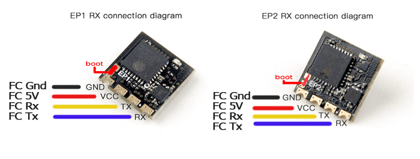
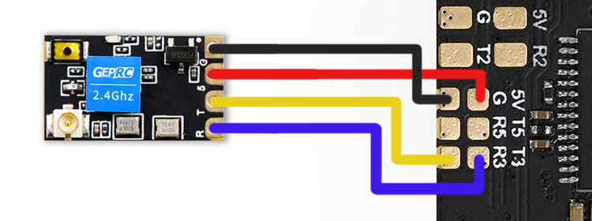

!!! tip "实用提示"
    有些厂家推荐的接收机 UART，或者专门分配给接收机的 UART，通常带有下拉电阻以适配 SBUS（RX 焊盘反转），这会导致 ESP 系列 ExpressLRS 接收机 LED 常亮。除非你了解 UART 原理，否则建议避免使用这些 UART。

!!! tip "小提示"
    KISS 飞控的 UART 命名可能不同。你可能需要将 RX 引脚接到 RX 焊盘，TX 引脚接到 TX 焊盘。务必查阅你的飞控接线图或说明书。

## 简介

基于 UART 的 ExpressLRS 接收机通过 CRSF 串口协议与飞控通信。该协议使用两根线：一根用于控制信号，另一根用于遥测信号。可以理解为双向高速公路。

下图是典型的 ExpressLRS 接收机引脚定义及与飞控焊盘的连接方式：

<figure markdown>

</figure>

ExpressLRS 接收机的 TX 引脚负责将遥控器接收到的控制信号发送给飞控；RX 引脚则接收飞控发来的遥测数据（如电池电压、电流、GPS 坐标、飞行姿态等），并回传给遥控器。

??? Tip "什么是 UART？（点击展开）"
    UART 是飞控上的一组 RX 和 TX 焊盘。通常把它当作飞控的“USB 接口”，可以连接不同的外设，比如 GPS 或接收机。每个 UART 只能连接一个设备，只能执行一个功能。

    R3 和 T3 属于 UART3；RX2 和 TX2 属于 UART2。不同厂家命名方式不同，有的用 "R" 和 "T" 加数字，有的用 "RX" 和 "TX" 加数字。

    __UART__ 即 Universal Asynchronous Receiver/Transmitter（通用异步收发器）

## 接收机接线

了解基础知识后，将接收机连接到飞控任意空闲 UART。查阅飞控接线手册，确认可用的 UART。

- GND 或 G 焊盘接飞控任意 GND 焊盘
- VCC 或 5 焊盘接飞控任意 5V（或 4.5V）焊盘
- TX 或 T 焊盘接飞控同一 UART 号的 RX 焊盘
- RX 或 R 焊盘接飞控同一 UART 号的 TX 焊盘

**即 TX RX 交叉连接**

<figure markdown>

</figure>

如果你自己焊接接收机，请检查焊盘间是否有短路，并清理助焊剂或残留物。

!!! warning "慢着！"
    先别急着给接收机套热缩管，还要做初步测试！

确保接线无短路后给接收机通电。

- 建议用电池给飞控供电，确保接收机在实际飞行条件下能正常工作。
- 通电前务必确认接线无短路。

观察接收机 LED，应该有以下几种状态：

|| LED 指示 | 状态说明 |
|---|---|---|
|| 慢闪(500ms)     | 等待与发射端连接 |
|| 双闪后暂停 | 进入对频模式 |
|| 快闪(25ms)   | 进入 WiFi 模式（60 秒后自动进入） |
|| 常亮 | 处于 Bootloader 模式 |

如果接收机带 RGB LED（如 Foxeer LNA、BetaFPV SuperD、Happymodel EP Dual），LED 状态如下：

| LED 指示 | 状态说明 |
|---|---|
| 彩虹渐变 | 启动中 |
| 慢闪(500ms) | 等待与发射端连接 |
| 橙色双闪后暂停 | 进入对频模式 |
| 绿色闪烁 | 进入 WiFi 模式（60 秒后自动进入） |

如果接收机 LED 完全不亮，请立即断电并检查接线。

如果你的接收机带 RGB LED（如 Foxeer LNA、BetaFPV SuperD、Happymodel EP Dual），且 LED 不亮但接线无误，可能是接收机进入了 Bootloader 模式。

如果接收机 LED 常亮，说明处于 Bootloader 模式（见上表）。

??? danger "接收机进入 Bootloader 模式怎么办？（点击展开）"

    遇到接收机进入 Bootloader 模式，可尝试以下方法：

    1. 检查接收机上的 Boot 按钮是否被按下或损坏。
        - 如果被按下或挤压，移除原因（如热缩管压到按钮）。
        - 如果损坏，建议更换或联系卖家售后。

    2. 如果没有 Boot 按钮而是 Boot 焊盘，检查 Boot 焊盘是否与 GND 焊盘连接。
        - 如果连接了 GND 焊盘，断开连接。

    3. 断开接收机的 RX 和 TX 线，重新上电，观察 LED。
        - 如果开始慢闪(500ms)，建议换到其他 UART。
        - 如果其他 UART 被占用，尝试加上拉电阻(300~1k 欧姆，越小效果越好)，把 UART 的 RX 焊盘与 5V(或 3.3V) 接上。

        <figure markdown>
        
        </figure>

    4. 如果你用的是数字图传（如 DJI Air Unit、Caddx Vista、DJI O3），且六根线都接到飞控，需要移除 SBUS/DJI HDL 线。

如果接收机工作正常（即未进入 Bootloader 模式），可断电并进行下一步：[飞控配置](../receivers/configuring-fc.md)